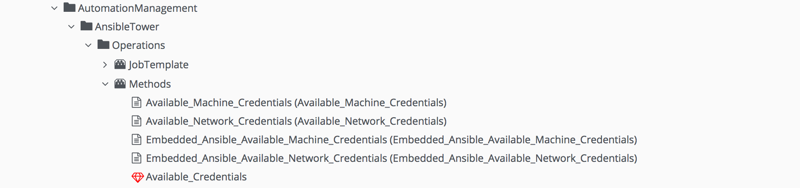
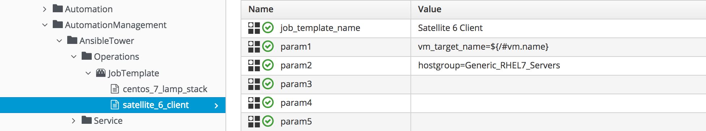

# Ansible Tower Provider Changes

CloudForms 4.1 (ManageIQ *Darga*) introduced the Ansible Tower provider that allows us to run Tower Job Templates on an external Ansible Tower server. The provider was designated as a **Configuration** provider, along with the Foreman and Satellite provider types.

Since CloudForms 4.5 (ManageIQ *Fine*) the Ansible Tower provider has been re-designated as an **Automation** provider. The provider explorer and jobs are accessed from **Automation -> Ansible Tower** in the WebUI.

## Automate Datastore Changes

In keeping with the designation change, the _ConfigurationManagement_ namespace has been renamed to _ConfigurationManagement (Deprecated)_ in the Automate Datastore, and a new _AutomationManagement_ namespace has been created containing the _AnsibleTower_ namespace. 

For example any user-written Automate methods that used

``` ruby
ANSIBLE_NAMESPACE = 'ConfigurationManagement/AnsibleTower/Operations'.freeze
``` 

should now use:

``` ruby
ANSIBLE_NAMESPACE = 'AutomationManagement/AnsibleTower/Operations'.freeze
``` 
### Shared Methods Between Tower Provider and Embedded Ansible

Some new instances and methods have been added to the new _AutomationManagement/AnsibleTower_ namespace, and the commonality between the Tower and embedded Ansible providers has enabled some code re-use.

The _Available\_Credentials_ method for example is used by two Tower-specific and two embedded Ansible-specific instances (see [Available Credentials Instances and Method](#i1)).



## Object Name Changes

The service model objects have also changed name. Any object that previously contained the string `ManageIQ_Providers_AnsibleTower_ConfigurationManager_*` has now been renamed as `ManageIQ_Providers_AnsibleTower_AutomationManager_*`.

As an example any user-written Automate methods that used the following object names in CloudForms 4.2:

``` ruby
SCRIPT_CLASS = 'ManageIQ_Providers_AnsibleTower_ConfigurationManager_ConfigurationScript'.freeze
JOB_CLASS    = 'ManageIQ_Providers_AnsibleTower_ConfigurationManager_Job'.freeze
```

Should now be re-written as:

``` ruby
SCRIPT_CLASS = 'ManageIQ_Providers_AnsibleTower_AutomationManager_ConfigurationScript'.freeze
JOB_CLASS    = 'ManageIQ_Providers_AnsibleTower_AutomationManager_Job'.freeze
```

### Common Objects Between Tower Provider and Embedded Ansible

Some objects that were Tower-specific have been renamed and are now common to both the Ansible Tower provider and embedded Ansible. An example of this is the inventory root group class:

``` ruby
INVENTORY_CLASS = 'ManageIQ_Providers_AutomationManager_InventoryRootGroup'.freeze
```

## Ansible Tower Provider Usage Tips

Considerable in-the-field experience has been accumulated in the time since the Ansible Tower provider was written and included in CloudForms 4.2 (ManageIQ _Euwe_). This section describes some of the real-world tips and tweaks that have proved useful when running Ansible Tower jobs from CloudForms.

### Handling Mixed IPv4 / IPv6 Addresses

The _AutomationManagement/AnsibleTower/Operations/StateMachines/Job/wait\_for\_ip_ method is a useful way of pausing a state machine until a VM is reachable on a network. The default method in the _ManageIQ_ Automate domain contains the following line to extract the list of VM's IP addresses:

``` ruby
  ip_list = vm.ipaddresses
```

This line extracts both IPv4 and IPv6 addresses from the VM's configuration, however the presence of an IPv6 address may not necessarily indicate that the VM has finished firstboot configuration and also has an IPv4 address (if IPv4 is to be used for Ansible playbook connectivity).

A useful edit is to modify the line to use the `Resolv::IPv4::Regex` regular expression from the `resolv` Ruby gem to extract only the IPv4 addresses, for example:


``` ruby
require 'resolv'
...

  ip_list = vm.ipaddresses.collect { |ip| ip if ip.match(Resolv::IPv4::Regex) }.compact
```

This will then continue looping until the VM has a valid IPv4 address, whereby the Ansible job can proceed.

### Using a Variable for 'hosts:' in a Playbook

For maximum flexibility an Ansible playbook run from Tower is often written with a generic `hosts` value, for example:

``` yaml
hosts: all
```

This allows the playbook to be run against an entire Tower inventory, or a restricted inventory sub-set defined by a Tower job template's _Limit_ override. 

The _AutomationManagement/AnsibleTower/Operations/StateMachines/Job/default_ state machine passes a `:limit` value as an _extra variable_ when invoking a Tower job template if either `$evm.root['vm']` or `$evm.root["miq_provision"].destination` are valid VM objects. Under certain exception conditions however the `:limit` extra variable can be left undefined when the Tower job is run, resulting in the playbook being executed against the _entire_ inventory. This could have undesirable consequences. 

To prevent this from happening, playbooks can be written to use an Ansible variable as the `hosts:` value, for example:


``` yaml
---
- hosts: "{{ vm_target_name }}"
  vars:
    vm_target_name:
  tasks:
    - debug:
        msg: "The Target VM Name is {{ vm_target_name }}"
```

The value of `vm_target_name` can be defined as a substitution variable in the job-specific instance of the _JobTemplate_ class (see [vm\_target\_name defined in the JobTemplate Instance](#i2)).



The VM's name will be substituted at run-time, however if for any exceptional reason the `$evm.root['vm']` object doesn't exist, a blank value will be passed to Tower, and the job will simply fail to run (fail-safe).

### Failing a Tower Job When a Target VM is Not in a Tower Inventory

Running a Tower job template on a newly provisoned VM involves the correct and complete synchronisation of two separate inventories: the updated VM list from the provider (such as vCenter) into CloudForms / ManageIQ, and the replication of this using a CloudForms inventory credential to Tower (if **Update on Launch** is set on the inventory).

If for any reason the Tower inventory fails to update, the Tower job will still run to completion with a **Status** of "Successful", but any plays will be skipped with the playbook output message "skipping: no hosts matched". In this situation the CloudForms job object will indicate success, and any subsequent Automate workflow stages will proceed, potentially erroneously.

To mitigate against this risk, any playbooks run as part of a post-provision operation can be edited to run the following play first:

``` yaml
- name: "Verify VM is in Inventory"
  hosts: localhost
  gather_facts: false
  tasks:
  - name: "Fail if VM is not in Inventory"
    fail:
      msg: "{{ vm_target_name }} is not in Ansible Tower's inventory."
    when: "vm_target_name not in groups['all']"
```

This play will cause the Tower job to fail if the target VM is not in a Tower inventory. The failure status will be returned to CloudForms, allowing the workflow state machine to more accurately determine a suitable course of action.

## Summary

This chapter has discussed some of the changes to the Ansible Tower provider with CloudForms 4.6 (ManageIQ *Gaprindashvili*), and some real-world usage tips when combining CloudForms VM provisioning with the execution of Ansible Tower jobs.

## Further Reading

[Red Hat CloudForms and Ansible Tower In the real world](https://www.redhat.com/en/blog/red-hat-cloudforms-and-ansible-tower-real-world)

[Dynamic Inventories in Ansible](https://www.tigeriq.co/dynamic-inventories-in-ansible/)

[Exposing 'prompt on launch' Inventories from Tower into CloudForms](https://www.tigeriq.co/list-inventories-in-service-dialog-when-they-are-set-to-prompt-on-launch-in-tower/)

[Automating Instance Provisioning with CloudForms and Ansible Tower](https://cloudformsblog.redhat.com/tag/tower/)
