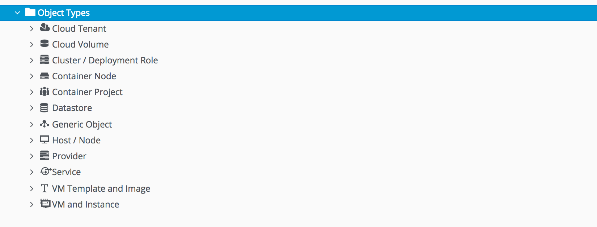
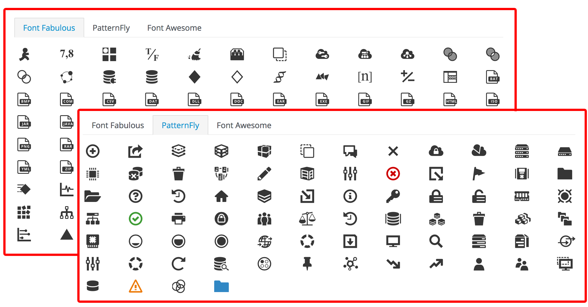
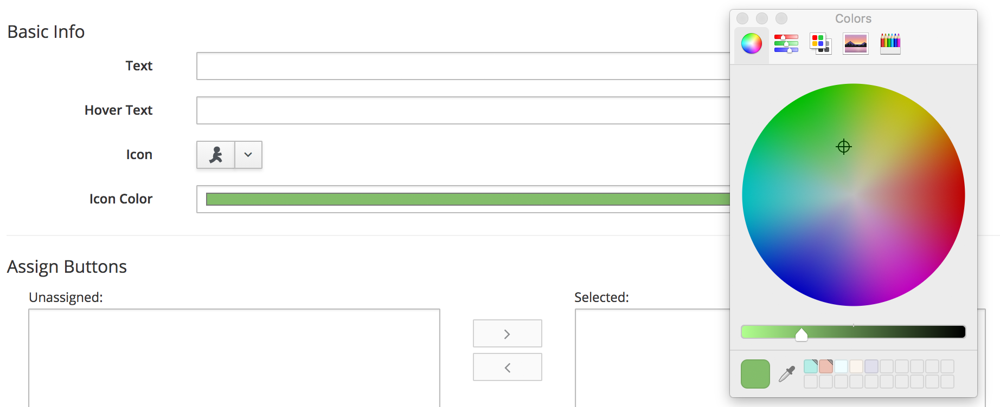
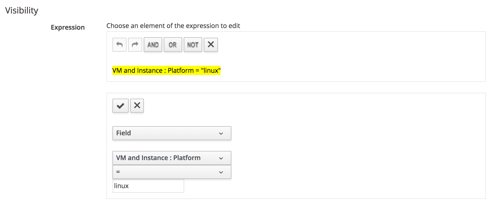
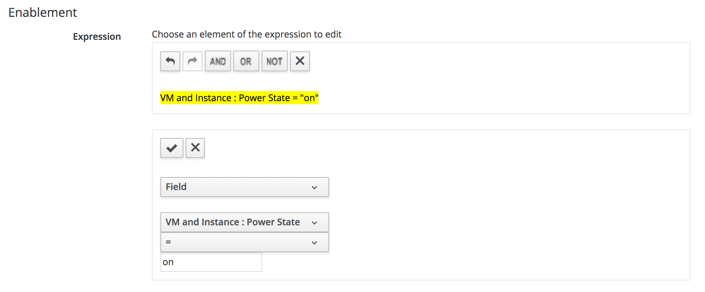
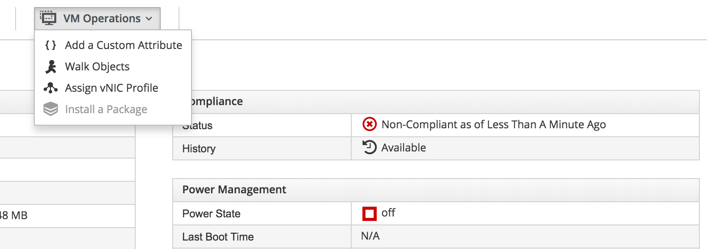
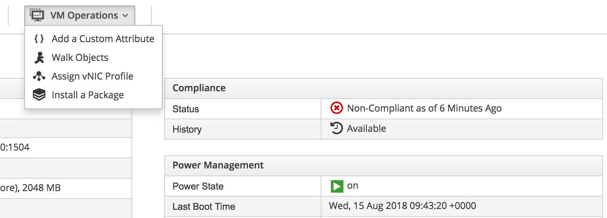
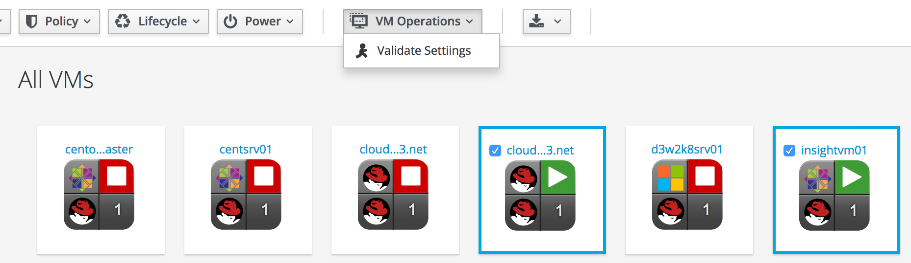

# Custom Buttons

Invoking services and automation workflows from custom buttons has been a very useful feature of CloudForms and ManageIQ for many versions. CloudForms 4.6 (ManageIQ *Gaprindashvili*) has expanded the capabilities of custom buttons in several ways.

## Support for More Object Types

Custom buttons can now be placed on a wider range of object types in the WebUI (see [Object Types Supported](#i1)).



## New Icons and Colours

Icons for both button groups and buttons can be selected from three different icon sets, and can be given a custom colour (see [Selecting the Icon](#i2) and [Selecting the Icon Colour](#i3)).





## Visibility Filtering

Many services or workflows triggered by custom buttons are only applicable to a certain sub-type of object that the button is displayed on. For example a button that registers a Red Hat Enterprise Linux VM with a Satellite server is not applicable to a VM running Windows, or Ubuntu Linux.

The new button functionality allows for a conditional visibility filter, that only displays the button in the button group if the visibility expression match is successful (see [Setting a Visibility Expression](#i4)).



## Conditional Enablement

The workflows or services triggered by some custom buttons often require the object to be in a particular state - for example a VM must be powered on to be able to run an Ansible playbook. Conditional enablement allows an expression to be defined, such that if the expression does not evaluate to _true_ for an object, the button is greyed out (see [Setting a Conditional Enablement Expression](#i4)).



This can be illustrated with a VM that has been evaluated by CloudForms as non-compliant, and requires a package to be installed to restore the compliance status. A button is available on the VM to install a package using an Ansible playbook, but the playbook requires the VM to be on.

If the VM is powered off, the **Install a Package** button is greyed out and cannot be used (see [Button Greyed Out When VM is Off](#i6)).



When the VM is powered on, the **Install a Package** button becomes enabled, and the package can be installed (see [Button Enabled When VM is On](#i7)).



## Multi-Selection of Objects

The only display option for custom buttons in previous versions of CloudForms and ManageIQ was on the details page of a single instance of the object type. With CloudForms 4.6 (ManageIQ *Gaprindashvili*) custom buttons can now be displayed for multiple instances of an object type (see [Multiple Instances Selected for a Button](#i8)).



> **Note**
> 
> Buttons that run on multiple objects must have no dialog associated with them

If a button is run against multiple objects in this way the button method can be either run once for all objects, or run individually for each object. If it is run once for all objects (**Submit all** in the WebUI), the button method will receive a list of object IDs along with a `target_object_type` attribute, as follows:

``` ruby
$evm.root['target_object_ids'] = [2, 3]   (type: Array)
$evm.root['target_object_type'] = VmOrTemplate   (type: String)
```

The method will not have a `$evm.root['vmdb_object_type']` attribute and will have to perform a `$evm.vmdb` lookup of each object ID to perform actions on the selected object.

If the button method is run separately for each object selected (**One by one** in the WebUI), each method's invocation _will_ have a `$evm.root['vmdb_object_type']` attribute, and a root object of that type (for example `$evm.root['vm']`).

To define a button's display options the **Display for** and **Submit** drop-downs are used (see ['Display for' and 'Submit' Selections](#i8)).


## Open URL

The custom button definition page includes a small **Open URL** checkbox. If this is ticked for a button assigned to a VM, the button method can open a new browser window by assigning a valid URL to the VM's `remote_console_url=` method.

The following button method example opens a new browser window to the corresponding RHV-Manager page for the VM on which the button is displayed:


``` ruby
url = "https://#{$evm.root['vm'].ext_management_system.hostname}" 
url += "/ovirt-engine/webadmin/?locale=en_US#vms-general;name=" 
url += $evm.root['vm'].name
$evm.root['vm'].remote_console_url = url
```

The _Open URL_ functionality allows an automate method to perform potentially complex tasks before a web page is displayed. An example might be setting up proxy servers for a VNC connection, so that the CloudForms or ManageIQ WebUI can open an HTML5 VNC client that connects through the tunnel.

## Summary

This chapter has described the new custom button functionality that comes with CloudForms 4.6 (ManageIQ *Gaprindashvili*). 
