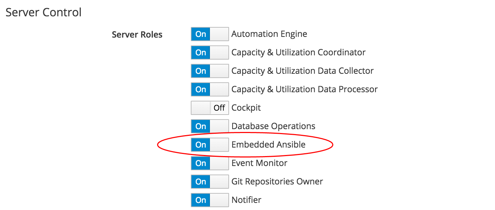
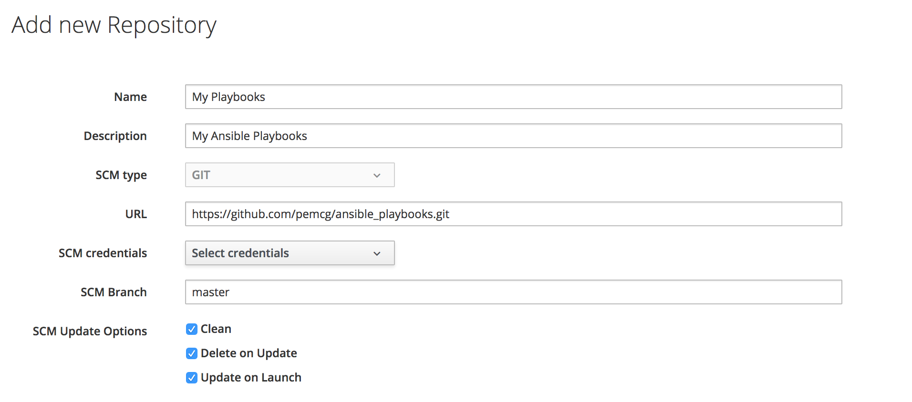

# Embedded Ansible Overview

CloudForms 4.5 (ManageIQ *Fine*) introduced an automation capability that uses an embedded Ansible automation engine to run Ansible playbooks as a new type of service. These services can be run interactively, or from Control events and Alert actions.

> **Note**
> 
> The embedded Ansible capability is also known by its Red Hat marketing name of *Ansible Automation Inside*

CloudForms 4.6 (ManageIQ *Gaprindashvili*) has extended the capabilities of embedded Ansible to allow us to run Ansible playbooks as automation methods.

## Enabling the Embedded Ansible Server Role

Before we can use the functionality of embedded Ansible, we must ensure that the server role is enabled on at least one CFME appliance in our region (see screenshot [Enabling the Embedded Ansible Server Role](#i1))



Although the server role can be set on more than one CFME or ManageIQ appliance, the embedded Ansible engine will only be active on at most one appliance in the region.

> **Notes**
> 
> The Embedded Ansible server role can take several minutes to activate when it is first enabled. Until it is fully activated, other embedded Ansible-related WebUI menu items - such as adding respositories or credentials - will appear greyed out.
> 
> With CloudForms 4.6 (ManageIQ *Gaprindashvili*) the Embedded Ansible server role should not be enabled if the CloudForms or ManageIQ region has a Highly Available (HA) database (the role will fail to start if the standby slave instance has been promoted to primary). With CloudForms 4.7 (ManageIQ *Hammer*) an HA database configuration is fully supported with embedded Ansible.

## Repositories

Ansible playbooks are often developed within the context of an associated directory structure that includes variable files, roles, inventory files and modules used by the playbook(s). The entire directory is then usually saved in a Software Configuration Management (SCM) tool such as Git.

Playbooks can only be imported into embedded Ansible from such an SCM tool. There is no facility to interactively create or edit playbooks in the CloudForms or ManageIQ WebUI.

### Defining a Repository

A new repository is added from the **Automation -> Ansible -> Repositories -> Configuration** button. The only SCM type currently supported is _GIT_ (see screenshot [Adding an Embedded Ansible SCM Repository](#i2)).



#### SCM Update Options

Three SCM update options can be selected:

* **Clean** - Remove any local modifications to files in the SCM repository prior to performing an update. This option might not be desirable if local vault files have been created, for example.

* **Delete on Update** - Delete the local SCM repository in its entirety prior to performing an update. Depending on the size of the repository this may significantly increase the amount of time required to complete an update.

* **Update on Launch** - Perform an update to the local repository prior to running any playbook from this SCM repository. This option delays the running of any playbook by several seconds, but always ensures that the most recently committed playbook is run.

Repositories are synchronised as project folders under the _/var/lib/awx/projects_ directory on the CFME appliance running the active **Embedded Ansible** server role.

## Credentials

Credentials are used to access managed entities that require authentication, such as nodes, networking devices, or cloud or infrastructure providers.

A new credential is added from the **Automation -> Ansible -> Credentials -> Configuration** button (see screenshot [Adding an Embedded Ansible Machine Credential](#i3)).


The following credential types are supported:

* **Machine** - used to define ssh credentials or private key to connect to a managed node. Also to define the privilege escalation mode to use (e.g. sudo, su), and associated escalation credentials.
* **Network** - used by Ansible networking modules to connect to and manage networking devices.
* **SCM** - used to define credentials to authenticate with Software Configuration Management (e.g. Git) repositories.
* **Vault** - stores an Ansible Vault password.
* **Amazon** - used to define credentials to connect to Amazon Web Services.
* **Azure** - used to define credentials to connect to Microsoft Azure Resource Manager.
* **Google Compute Engine** - used to define credentials to connect to Google Compute Engine.
* **OpenStack** -  used to define credentials to connect to OpenStack.
* **VMware** - used to define credentials to connect to VMware vCenter.
* **Red Hat Virtualization** - used to define credentials to connect to a Red Hat Virtualization Manager (RHV-M)

A credential called **CFME Default Credential** is created automatically when the **Embedded Ansible** server role is first enabled. This can be used when running playbooks on _localhost_, which is the CFME or ManageIQ appliance running the embedded Ansible automation engine.

## Playbook Variables and Facts

Many variables and facts are available to an Ansible playbook at run-time, including several that are CloudForms / ManageIQ specific. These are made available to the running playbook by the embedded Ansible automation engine.

Playbook variables and facts can be examined using a simple Ansible role such as the following _ansible-role-listvars_ playbook:

``` yaml
---
- name: Display all Environment Variables
  debug:
    var: environment
- name: Display all group names
  debug:
    var: group_names
- name: Display all groups
  debug:
    var: groups
- name: Display all variables/facts known for a host
  debug:
    var: hostvars[inventory_hostname]
```
This role can be included in any other playbook, and will write the debugging output to the usual STDOUT.

## Playbook Inventory

An Ansible playbook runs on a list of systems defined in an _inventory_. When a playbook is launched the embedded Ansible automation engine dynamically creates an inventory group called _all_ containing the list of hosts on which the playbook should run.

This can be seen from the _groups_ variable that is visible to a playbook when it runs (displayed using the _ansible-role-listvars_ role described above):

``` yaml
TASK [ansible-role-listvars : Display all groups] ******************************
ok: [localhost] => {
    "groups": {
        "all": [
            "10.1.13.130"
        ],
        "ungrouped": [
            "10.1.13.130"
        ]
    }
}
```

This simplifies matters when creating playbooks to run from embedded Ansible. In the playbook we always specify:

``` yaml
hosts: all
```

Playbooks are generally run on _localhost_ (the CloudForms / ManageIQ appliance itself) or on one or more managed nodes.

## Using Ansible Roles in Playbooks

Many Ansible playbooks use the functionality of Ansible roles, defined elsewhere (including Ansible Galaxy). If these are to be used in an embedded Ansible playbook, a _roles/requirements.yml_ file should be included in the root of the playbook's repository, referencing the external roles, for example:

``` yaml
---
# from galaxy
- src: syncrou.manageiq-automate
- src: syncrou.manageiq-vmdb
# from GitHub
- src: https://github.com/pemcg/ansible-role-listvars
  version: master
  name: ansible-role-listvars
# from a webserver, where the role is packaged in a tar.gz
- src: https://some.webserver.example.com/files/master.tar.gz
  name: http-role
# from GitLab or other git-based scm
- src: git@gitlab.company.com:mygroup/ansible-base.git
  scm: git
  version: "0.1"  # quoted, so YAML doesn't parse this as a floating-point value
```

Before the playbook is launched, a 'system' playbook _/var/lib/awx/venv/awx/lib/python2.7/site-packages/awx/playbooks/project\_update.yml_ ensures that all pre-requisite roles are installed by running `ansible-galaxy install -r requirements.yml`. The output from this playbook is visible in a job-specific _.out_ file in _/var/lib/awx/job\_status_, as follows:

```
...
TASK [fetch galaxy roles from requirements.yml] ********************************
changed: [localhost]
...
```

## Running Multiple Playbooks Concurrently

Embedded Ansible playbooks can be run concurrently against several different inventories, with the following caveats:

* If an SCM repository is set to "update on launch", then its playbooks are not run concurrently. Any additional playbook jobs run from the same repository will be held pending behind the SCM update. The SCM repository will not update until after the currently running job has completed.

* There is a limit of one concurrent job for each inventory. In practice the embedded Ansible engine creates a unique inventory object for each static or dynamic `hosts` list defined for each playbook method or playbook service.

## Embedded Ansible Configuration

Embedded Ansible has a small customisation section in the **Configuration -> Advanced** settings list, as follows:

```
:embedded_ansible:
  :job_data_retention_days: 120
  :docker:
    :task_image_name: ansible/awx_task
    :task_image_tag: latest
    :web_image_name: ansible/awx_web
    :web_image_tag: latest
    :rabbitmq_image_name: rabbitmq
    :rabbitmq_image_tag: 3
    :memcached_image_name: memcached
    :memcached_image_tag: alpine
```

Although most settings would not need changing in normal operation, the `job_data_retention_days` value may need adjusting on a busy CFME or ManageIQ appliance. This determines the retention time in days that the playbook _.out_ files are kept for in _/var/lib/awx/job\_status_ (see Troubleshooting chapter). On a busy system running many verbose playbooks, the number of _.out_ files may consume significant space on the system disk, in which case the `job_data_retention_days` value should be reduced accordingly.

> **Note**
> 
> The playbook output for an embedded Ansible service is shown in the service's **Provisioning** or **Retirement** tab in the **Services -> My Services** page in the WebUI. This output is read directly from the corresponding job's _.out_ file, and so once the _*.out_ files are purged, the output is longer visible from the service details in the WebUI.
> 

## Zone Implications

The ManageIQ::Providers::EmbeddedAnsible::AutomationManager provider attaches itself to the zone that the appliance is in when the **Embedded Ansible** server role is enabled. Subsequently moving the appliance into a different zone does not change the provider's zone, and so the **Embedded Ansible** server role should be disabled and re-enabled to ensure that the provider is re-configured in the new zone correctly.

## Events

The following events are emitted from the embedded Ansible engine:

```
System/Event/EmsEvent/EMBEDDEDANSIBLE/job_create
System/Event/EmsEvent/EMBEDDEDANSIBLE/job_template_associate
System/Event/EmsEvent/EMBEDDEDANSIBLE/job_template_create
System/Event/EmsEvent/EMBEDDEDANSIBLE/job_template_delete
System/Event/EmsEvent/EMBEDDEDANSIBLE/project_update_associate
```

Although none are handled by default in the event switchboard, an event handler could be created if required to perform actions on receipt of such an event.

## Summary

This chapter has presented an overview of the new embedded Ansible functionality. It has also described how to add SCM repositories so that Ansible playbooks can be imported into CloudForms / ManageIQ, and machine credentials to allow playbooks to run on a managed node. These are the prerequisite steps to being able to run Ansible playbooks as services or automation methods.

## Further Reading

[Ansible playbook best practices](https://docs.ansible.com/ansible/latest/user_guide/playbooks_best_practices.html)

[Differences between ManageIQ's integration with Ansible Tower and embedded Ansible](http://talk.manageiq.org/t/differences-between-manageiqs-integration-with-ansible-tower-and-embedded-ansible/2917)