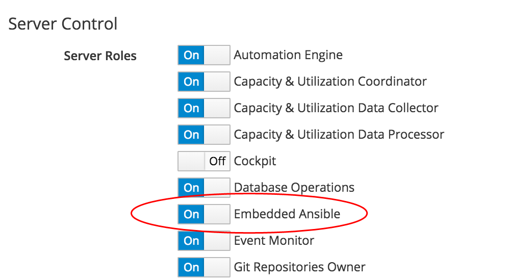
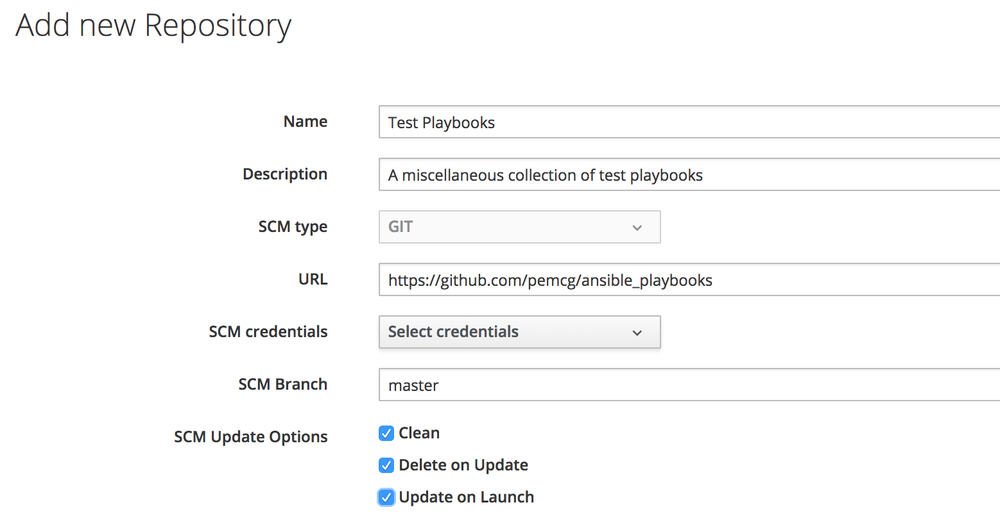
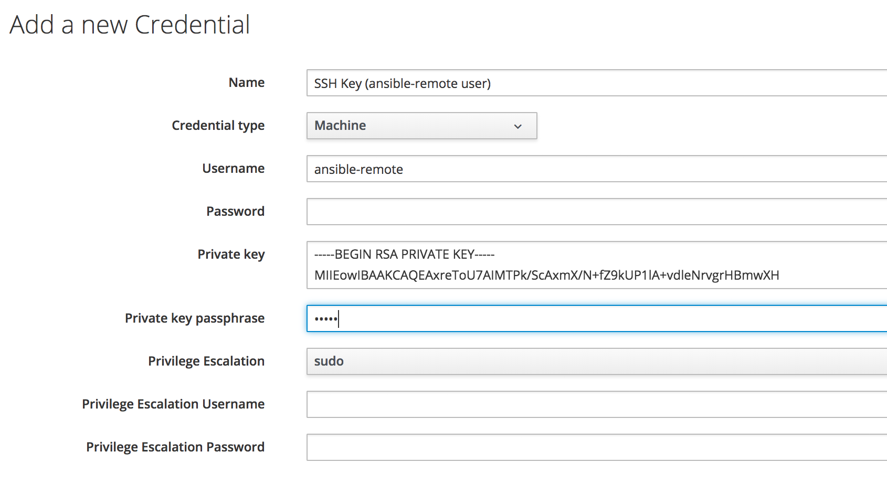

# Embedded Ansible Overview

CloudForms 4.5 (ManageIQ *Fine*) introduced an automation capability
that uses an embedded Ansible automation engine to run Ansible playbooks
as a new type of service. These services can be run interactively, or
from Control events and Alert actions.

> **Note**
> 
> The embedded Ansible capability is also known by its Red Hat marketing
> name of *Ansible Automation Inside*

CloudForms 4.6 (ManageIQ *Gaprindashvili*) has extended the capabilities
of embedded Ansible to allow us to run Ansible playbooks as automation
methods.

## Enabling the Embedded Ansible Server Role

Before we can use the functionality of embedded Ansible, we must ensure that the server role is enabled on at least one CFME appliance in our region (see [Enabling the Embedded Ansible Server Role](#i1))




Although the server role can be set on more than one CFME appliance, the embedded Ansible engine will only be active on at most one appliance in the region.

## Repositories

Ansible playbooks are often developed within the context of an associated directory structure that includes variable files, roles, inventory files and modules used by the playbook(s). The entire directory is then usually saved in a Software Configuration Management (SCM) tool such as Git.

Playbooks can only be imported into embedded Ansible from such an SCM tool. There is no facility to interactively create or edit playbooks in the CloudForms or ManageIQ WebUI.

### Defining a Repository

A new repository is added from the **Automation -> Ansible -> Repositories -> Configuration** button. The only SCM type currently supported is _GIT_ (see [Adding an Embedded Ansible SCM Repository](#i1)).



#### SCM Update Options

Three SCM update options can be selected:

* **Clean** - Remove any local modifications to files in the SCM repository prior to performing an update. This option might not be desirable if local vault files have been created, for example.

* **Delete on Update** - Delete the local SCM repository in its entirety prior to performing an update. Depending on the size of the repository this may significantly increase the amount of time required to complete an update.

* **Update on Launch** - Perform an update to the local repository prior to running any playbook from this SCM repository. This option delays the running of any playbook by several seconds, but always ensures that the most recently committed playbook is run.

Repositories are synchronised as project folders under the _/var/lib/awx/projects_ directory on the CFME appliance running the active Embedded Ansible server role.

## Credentials

A new credential is added from the **Automation -> Ansible -> Credentials -> Configuration** button.



The following credential types are supported:

* **Machine** - used to define ssh credentials or private key to connect to a managed node. Also to define the privilege escalation mode to use (e.g. sudo, su), and associated escalation credentials.
* **Network** - used by Ansible networking modules to connect to and manage networking devices.
* **SCM** - used to define credentials to authenticate with Software Configuration Management (e.g. Git) repositories.
* **Vault** - stores an Ansible Vault password.
* **Amazon** - used to define credentials to connect to Amazon Web Services.
* **Azure** - used to define credentials to connect to Microsoft Azure Resource Manager.
* **Google Compute Engine** - used to define credentials to connect to Google Compute Engine.
* **OpenStack** -  used to define credentials to connect to OpenStack.
* **VMware** - used to define credentials to connect to VMware vCenter.
* **Red Hat Virtualization** - used to define credentials to connect to a Red Hat Virtualization Manager (RHV-M).
 
 
## Playbook Inventory

An Ansible playbook runs on a list of systems defined in an _inventory_. An inventory group called _all_ is created on-the-fly when an embedded Ansible playbook is launched. This can be seen from the _groups_ variable that is visible to a playbook when it runs:

``` yaml
…
"groups": {
    "all": [
        "192.168.1.182"
     ],
     "ungrouped": [
         "192.168.1.182"
     ]
}
```

This makes life simple when creating playbooks to run from embedded Ansible. In the playbook we just specify:

``` yaml
hosts: all
```

## References

[Ansible playbook best practices](https://docs.ansible.com/ansible/latest/user_guide/playbooks_best_practices.html)