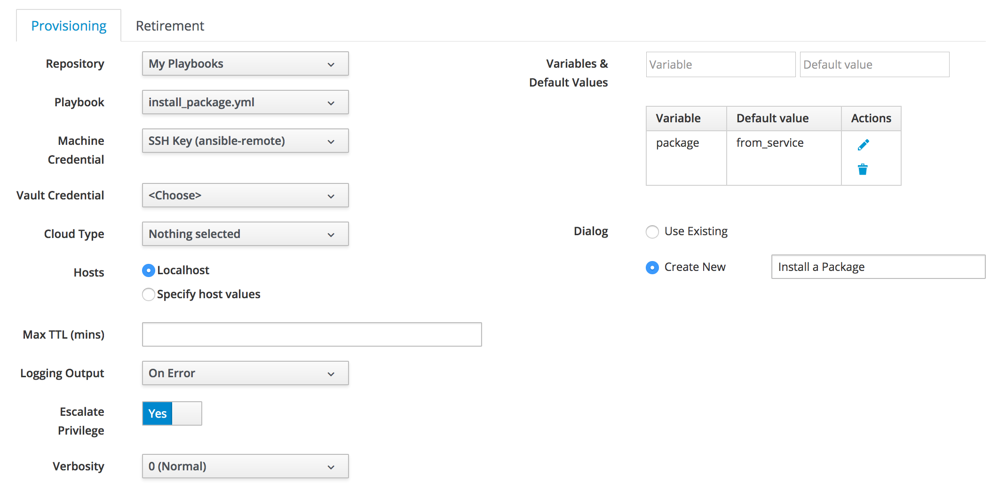
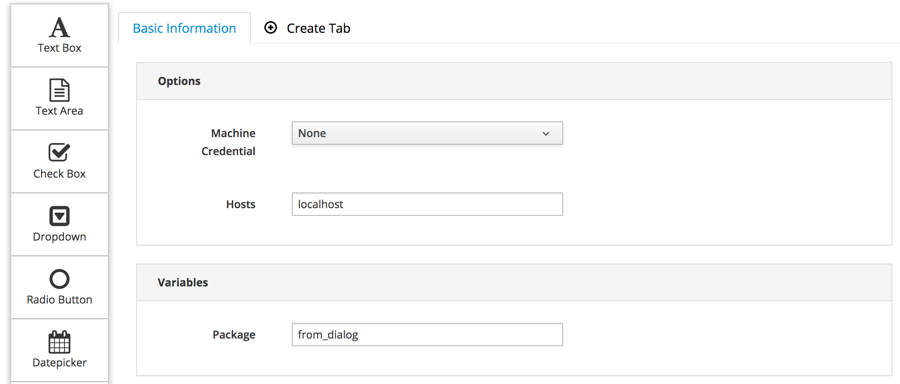
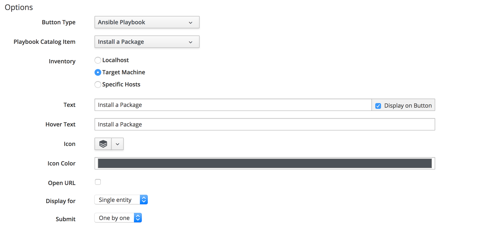
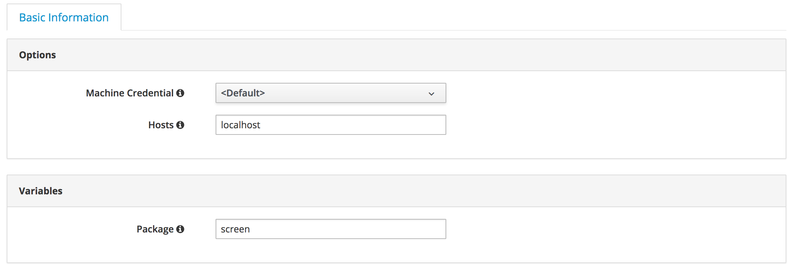
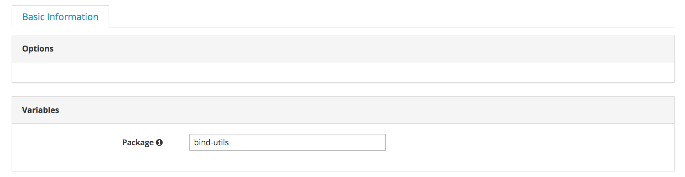
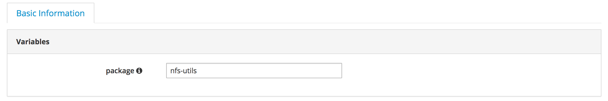

# Running an Embedded Ansible Playbook Service on a VM from a Button

In this example we’ll create a button on a VM that can be used to install an RPM package on the VM, via an Ansible playbook service.

CloudForms 4.6 adds a new feature called **Button Type** to custom buttons. One of the available button types is **Ansible Playbook**, which allows an existing Ansible playbook service to be run on the object (VM, Host etc) displaying the button in the WebUI. 

The **Ansible Playbook** button type still calls the _/System/Request/Order\_Ansible\_Playbook_ instance to launch the playbook service, but it simplifies the process of creating the parameters that the _order\_ansible\_playbook_ method uses. It also has no separate button dialog; the service's dialog is used when a user orders the button.

For this example a simple playbook will be run that installs a package using the `yum` module onto the VM displaying the custom button.

``` yaml
---
- name: Install Package
  hosts: all
  vars: 
    package: from_playbook

  tasks:
  - name: Install package
    yum: name={{ package }} state=present
```

A default value of 'from_playbook' for the package variable is defined for the purposes of troubleshooting.

## Pre-Requisites
This example assumes that the following pre-requisites have been created:

* The Git repository containing the playbook has been added to embedded Ansible Automation.
* A machine credential has been created that allows ssh access to the target VM. For this example an ssh key is used to connect to the target as the _ansible-remote_ user. The credential uses sudo privilege escalation to run as root.

To assist in troubleshooting, a call to _object\_walker_ has been made from the _/System/Request/Order\_Ansible\_Playbook_ instance (to view the arguments passed to the _order\_ansible\_playbook_ method), and from the _/Service/Generic/StateMachines/GenericLifeCycle/provision_ service provision state machine.

## Creating the Service

The Ansible playbook service called **Install a Package** is first created (see [Adding the New Service Catalog Item](#i1)).



### Values Selected

The following parameter values should be selected on the **Provisioning** tab:

* **Machine Credential** -  The _ansible-remote_ user's machine credential defined earlier (this can be overridden when the playbook is run)
* **Hosts** - Localhost (this will be overridden when the playbook is run)
* **Escalate Privilege** - Yes (installing a package requires root privileges)
* **Variables & Default Values** - Add the _package_ variable with a default value of 'from_service'
* **Dialog** - Create New

> **Note**
>
> Defining the playbook variables such as "package" here with default values ensures that they are added to the newly created service dialog correctly.

Clicking **Save** creates both the new service and service dialog.

### Editing the Service Dialog

If the newly created service dialog is edited, it can be seen that the package element has been given the correct name "param\_package" (as required by the _order\_ansible\_playbook_ method), and the default value of "from\_service". For this example we'll change the default value for the **Package** dialog element to "from\_dialog" to identify if the dialog's default value was used in operation (see [Editing the Service Dialog](#i2)).



Once the dialog has been created, the only use for the package variable and value in the service definition is to provide a fallback in case the package is not specified in the dialog. It can otherwise be deleted.

### Creating the Button

The button called **Install a Package** is created as follows (see [Adding the New Button](#i3)):



### Values Selected

The following parameter values are selected:

* **Button Type** - Ansible Playbook
* **Playbook Catalog Item** - The service catalog item created earlier
* **Inventory** - Target Machine


For this example the values in the **Advanced** tab are left as default.

The selection of a button dialog is not available for an Ansible Playbook type button as the dialog for the service is used.

## Testing the Button

The button can be tested with several permutations of dialog values so that the input parameters can be examined. 

A powered-on VM with the IP address of 192.168.1.66 is identified in the CloudForms WebUI, and the VM's details are displayed. 

### Test 1

Click the **Install a Package** button from the VM details page. 

When the dialog is displayed, leave the **Machine Credential** and **Hosts** elements at their defaults. Specify "screen" as the package (see [Default Dialog](#i4)).



The playbook runs successfully on the VM displaying the button, in accordance with the button definition's **Inventory** setting of **Target Machine**. The "screen" package is installed.

> **Note**
> 
> The value of _localhost_ in the **Hosts** dialog element has been ignored in this case. It is overriden by the button definition's **Inventory** setting of **Target Machine**, which takes priority.

The Ansible playbook output shows that the playbook has been run on 192.168.1.66, which is the IP address of the target VM:

```
TASK [Install package] *********************************************************
ok: [192.168.1.66]

PLAY RECAP *********************************************************************
192.168.1.66               : ok=6    changed=1    unreachable=0    failed=0‍‍‍‍‍‍‍‍‍‍‍‍‍‍‍‍‍‍‍‍‍‍‍‍‍‍‍‍‍‍‍‍‍‍‍‍‍‍‍‍‍‍‍‍‍‍‍‍‍‍‍‍‍‍‍‍‍‍‍‍‍‍‍‍‍‍‍‍‍‍‍‍‍‍‍‍‍‍‍‍‍‍‍‍‍‍‍‍‍‍‍‍‍‍‍‍
```

#### Test 1 Investigative Debugging

Examining the _object\_walker_ output shows that the following `$evm.root` parameters have been created as inputs for _order\_ansible\_playbook_:

```
$evm.root['dialog_hosts'] = localhost   (type: String)
$evm.root['dialog_param_package'] = screen   (type: String)
$evm.root['hosts'] = vmdb_object   (type: String)
```

It can be seen that no value for machine credential has been passed, so the default value defined in the service catalog item has been used. 

The service provision state machine options hash is as follows:

```
$evm.root['service'].options[:config_info] = {:provision=>{:repository_id=>"4", :playbook_id=>"182", :credential_id=>"11", :hosts=>"localhost", :verbosity=>"0", :log_output=>"on_error", :extra_vars=>{:package=>{:default=>"from_service"}}, :execution_ttl=>"", :become_enabled=>true, :new_dialog_name=>"Install a Package", :fqname=>"/Service/Generic/StateMachines/GenericLifecycle/provision", :dialog_id=>31}, :retirement=>{:remove_resources=>"yes_without_playbook", :verbosity=>"0", :log_output=>"on_error", :fqname=>"/Service/Generic/StateMachines/GenericLifecycle/Retire_Basic_Resource"}}   (type: Hash)
$evm.root['service'].options[:dialog] = {"dialog_credential"=>nil, "dialog_hosts"=>"192.168.1.66", "dialog_param_package"=>"screen"}   (type: Hash)
$evm.root['service'].options[:provision_job_options] = {"hosts"=>"192.168.1.66", "extra_vars"=>{"package"=>"screen"}, "inventory"=>38}   (type: ActiveSupport::HashWithIndifferentAccess)
```
‍
It can be seen that _order\_ansible\_playbook_ has used the IP address of the current VM when creating the service template provision request, even though the `$evm.root['dialog_hosts']` value was set to "localhost". The `$evm.root['hosts']` key has taken priority over `$evm.root['dialog_hosts']`.

The default action is for `$evm.root['hosts']` to take priority if it has been defined as "vmdb_object" (which the **Ansible Playbook** button type sets for us automatically if **Inventory** is set to **Target Machine**).

### Test 2

For the same VM, repeat the button click. 

When the dialog is displayed, set the **Machine Credential** to "SSH Key (ansible-remote)" but leave the **Hosts** element at its default. Specify "screen" as the package once more.

Once again the playbook runs successfully on the VM displaying the button (the _target_ VM), in accordance with the button definition's **Inventory** setting of **Target Machine**. The "screen" package is already installed so the playbook makes no changes. 

The playbook output is as follows:

```
TASK [Install package] *********************************************************
ok: [192.168.1.66]

PLAY RECAP *********************************************************************
192.168.1.66               : ok=6    changed=0    unreachable=0    failed=0...
```

#### Test 2 Investigative Debugging

Examining the _object\_walker_ output shows that the selected credential object ID is now included as one of the `$evm.root` inputs for _order\_ansible\_playbook_:

```
$evm.root['dialog_credential'] = 11   (type: String)
$evm.root['dialog_hosts'] = localhost   (type: String)
$evm.root['dialog_param_package'] = screen   (type: String)
$evm.root['hosts'] = vmdb_object   (type: String)
```

The service provision state machine options hash is as follows:

```
$evm.root['service'].options[:config_info] = {:provision=>{:repository_id=>"4", :playbook_id=>"182", :credential_id=>"11", :hosts=>"localhost", :verbosity=>"0", :log_output=>"on_error", :extra_vars=>{:package=>{:default=>"from_service"}}, :execution_ttl=>"", :become_enabled=>true, :new_dialog_name=>"Install a Package", :fqname=>"/Service/Generic/StateMachines/GenericLifecycle/provision", :dialog_id=>31}, :retirement=>{:remove_resources=>"yes_without_playbook", :verbosity=>"0", :log_output=>"on_error", :fqname=>"/Service/Generic/StateMachines/GenericLifecycle/Retire_Basic_Resource"}}   (type: Hash)
$evm.root['service'].options[:dialog] = {"dialog_credential"=>"11", "dialog_hosts"=>"192.168.1.66", "dialog_param_package"=>"screen"}   (type: Hash)
$evm.root['service'].options[:provision_job_options] = {"hosts"=>"192.168.1.66", "extra_vars"=>{"package"=>"screen"}, "credential"=>"4", "inventory"=>39}   (type: ActiveSupport::HashWithIndifferentAccess)
```

It can be seen that the `dialog_credential` dialog option is no longer `nil` in the options hash.

### Test 3

For the same VM, repeat the button click. 

When the dialog is displayed, set the **Machine Credential** to "CFME Default Credential" but leave the **Hosts** element at its default. Specify "screen" as the package once more.

As expected the playbook fails to run as the credential is invalid for the VM selected:

```
TASK [Gathering Facts] *********************************************************
fatal: [192.168.1.66]: UNREACHABLE! => {"changed": false, "msg": "Failed to connect to the host via ssh...
```

#### Test 3 Investigative Debugging

The dialog's value for **Machine Credential** has overridden the default credential defined when the service was created.

### Test 4

Edit the dialog to make the **Machine Credential** and **Hosts** elements non-visible. This should force the default values to be submitted. 

For the same VM, repeat the button click. 

When the edited dialog is displayed, specify "bind-utils" as the package (see [Dialog With Options Box Elements Hidden](#i5)).



The package installation was successful:

```
TASK [Install package] *********************************************************
changed: [192.168.1.66]

PLAY RECAP *********************************************************************
192.168.1.66               : ok=6    changed=1    unreachable=0    failed=0‍‍‍‍‍‍‍‍‍‍‍‍‍‍‍‍‍‍‍‍‍‍‍‍‍‍‍‍‍‍‍‍‍‍‍‍‍‍‍‍‍‍‍‍‍‍‍‍‍‍‍‍‍‍‍‍‍‍‍‍‍‍‍‍‍
```

#### Test 4 Investigative Debugging

Examining the _object\_walker_ output shows that the `$evm.root` inputs for _order\_ansible\_playbook_ are just as when the elements were visible. 

The default values are submitted:

```
$evm.root['dialog_hosts'] = localhost   (type: String)
$evm.root['dialog_param_package'] = bind-utils   (type: String)
$evm.root['hosts'] = vmdb_object   (type: String)
```

The service options hash is unaffected by the hiding of the dialog elements:

```
$evm.root['service'].options[:config_info] = {:provision=>{:repository_id=>"4", :playbook_id=>"182", :credential_id=>"11", :hosts=>"localhost", :verbosity=>"0", :log_output=>"on_error", :extra_vars=>{:package=>{:default=>"from_service"}}, :execution_ttl=>"", :become_enabled=>true, :new_dialog_name=>"Install a Package", :fqname=>"/Service/Generic/StateMachines/GenericLifecycle/provision", :dialog_id=>31}, :retirement=>{:remove_resources=>"yes_without_playbook", :verbosity=>"0", :log_output=>"on_error", :fqname=>"/Service/Generic/StateMachines/GenericLifecycle/Retire_Basic_Resource"}}   (type: Hash)
$evm.root['service'].options[:dialog] = {"dialog_credential"=>nil, "dialog_hosts"=>"192.168.1.66", "dialog_param_package"=>"bind-utils"}   (type: Hash)
$evm.root['service'].options[:provision_job_options] = {"hosts"=>"192.168.1.66", "extra_vars"=>{"package"=>"bind-utils"}, "inventory"=>42}   (type: ActiveSupport::HashWithIndifferentAccess)
```

### Test 5

Edit the dialog to delete the **Options** box containing the **Machine Credential** and **Hosts** elements in the dialog. 

For the same VM, repeat the button click. 

When the edited dialog is displayed, specify "nfs-utils" as the package (see [Dialog With Options Box Removed](#i6)).



The package installation fails:

```
TASK [Gathering Facts] *********************************************************
fatal: [localhost]: FAILED! => {"changed": false, "failed": true,...
```

#### Test 5 Investigative Debugging

Examining the _object\_walker_ output shows that the `$evm.root` inputs for _order\_ansible\_playbook_ are as follows:

```
$evm.root['dialog_param_package'] = nfs-utils   (type: String)
$evm.root['hosts'] = vmdb_object   (type: String)
```

The service options hash shows that without a `$evm.root['dialog_hosts']` value, the package installation was attempted on _localhost_. This is the default if no `$evm.root['dialog_hosts']` value is supplied to an Ansible service. 

```
$evm.root['service'].options[:config_info] = {:provision=>{:repository_id=>"4", :playbook_id=>"182", :credential_id=>"11", :hosts=>"localhost", :verbosity=>"0", :log_output=>"on_error", :extra_vars=>{:package=>{:default=>"from_service"}}, :execution_ttl=>"", :become_enabled=>true, :new_dialog_name=>"Install a Package", :fqname=>"/Service/Generic/StateMachines/GenericLifecycle/provision", :dialog_id=>31}, :retirement=>{:remove_resources=>"yes_without_playbook", :verbosity=>"0", :log_output=>"on_error", :fqname=>"/Service/Generic/StateMachines/GenericLifecycle/Retire_Basic_Resource"}}   (type: Hash)
$evm.root['service'].options[:dialog] = {"dialog_param_package"=>"nfs-utils"}   (type: Hash)
$evm.root['service'].options[:provision_job_options] = {"hosts"=>"localhost", "extra_vars"=>{"package"=>"nfs-utils"}}   (type: ActiveSupport::HashWithIndifferentAccess)
```

## Summary

This chapter has shown how a custom button can be added to a VM to run an Ansible playbook on that VM. 

Testing various combinations of dialog inputs versus default service and button values can help us gain an understanding of what's happening behind the scenes.

## Further Reading

[Add Ansible Playbook custom button](https://github.com/ManageIQ/manageiq-ui-classic/pull/1972)

[Add Ansible Playbook custom button type](https://github.com/ManageIQ/manageiq/pull/15874)