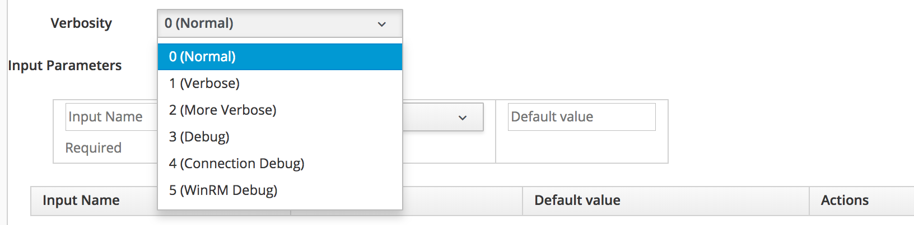

# Troubleshooting Embedded Ansible

This chapter contains some miscellaneous troubleshooting tips for the embedded Ansible Automation engine, and for the running playbooks themselves.

## Troubleshooting the Embedded Ansible Engine (AWX)

When troubleshooting why playbooks are not running as intended, it can sometimes be useful to confirm that the embedded Ansible Automation engine - which is based on the AWX project - is running correctly.

### AWX Processes 

The AWX processes are managed by supervisord, and can be checked using `supervisorctl` as follows:

```
# supervisorctl
exit-event-listener                     RUNNING   pid 17390, uptime 20 days, 3:15:47
tower-processes:awx-callback-receiver   RUNNING   pid 17394, uptime 20 days, 3:15:47
tower-processes:awx-celeryd             RUNNING   pid 17396, uptime 20 days, 3:15:47
tower-processes:awx-celeryd-beat        RUNNING   pid 17395, uptime 20 days, 3:15:47
tower-processes:awx-channels-worker     RUNNING   pid 17391, uptime 20 days, 3:15:47
tower-processes:awx-daphne              RUNNING   pid 17393, uptime 20 days, 3:15:47
tower-processes:awx-uwsgi               RUNNING   pid 17392, uptime 20 days, 3:15:47
supervisor>
```

The supervisord configuration is located in _/etc/supervisord.d/tower.ini_.

### AWX Services

There are three systemd services associated with AWX, as follows:

```
systemctl status supervisord
systemctl status nginx
systemctl status rabbitmq-server
```

### Rails Console Checks

The health of AWX can be checked from the Rails. The `EmbeddedAnsible.new.running?` method checks that the supervisord, nginx and rabbitmq-server services are running correctly.

```
irb(main):001:0> EmbeddedAnsible.new.running?
=> true
```

The Rails `EmbeddedAnsible.new.alive?` method pings the Ansible server using the auto-configured credentials. This verifies that the credentials are setup correctly.

```
irb(main):002:0> EmbeddedAnsible.new.alive?
=> true
```

### AWX Logs

The AWX services write to 2 log files:

```
/var/log/supervisor/
/var/log/tower/
```

There is also some AWX-related logging in _/var/www/miq/vmdb/log/evm.log_.

### AWX Authentication Settings

The AWX `admin` account password is randomly generated during installation (when the **Embedded Ansible** server role is first enabled), and these credentials are used by CloudForms / ManageIQ to access the internal AWX API. If required for troubleshooting purposes the password string can be retrieved using the Rails console, for example:

```
irb(main):003:0> MiqDatabase.first.ansible_admin_authentication.password
=> "TxaUkrPwmLWNMCDyyimVSL8b"
```

### Virtual Environment

AWX maintains all playbooks and python libraries in a virtual environment under _/var/lib/awx/venv_. To install or update anything in the virtual environment the `activate/deactivate` commands should be used, for example:

```
source /var/lib/awx/venv/ansible/bin/activate
umask 0022
pip install --upgrade pywinrm
deactivate
```

## Troubleshooting Embedded Ansible Jobs

Each invocation of an embedded Ansible playbook service or method is implemented by the running of an embedded Ansible job.

### Job Log Files

Each time an embedded Ansible job runs, up to three _.out_ files are created in _/var/lib/awx/job\_status_ on the CFME or ManageIQ appliance with the active **Embedded Ansible** role. The first two of these files show the results of synchronising the git repository and updating any roles, and the last file contains the output from the automation playbook itself. Depending on the

```
...
-rw-r--r--. 1 awx awx  7168 Jul 30 17:19 823-53c83b2a-9414-11e8-a6de-001a4aa01501.out
-rw-r--r--. 1 awx awx  7163 Jul 30 17:19 824-59a348dc-9414-11e8-bace-001a4aa01501.out
-rw-r--r--. 1 awx awx  5759 Jul 30 17:19 822-60bfda04-9414-11e8-bace-001a4aa01501.out
-rw-r--r--. 1 awx awx  7168 Jul 30 17:33 826-378d7702-9416-11e8-bace-001a4aa01501.out
-rw-r--r--. 1 awx awx  7163 Jul 30 17:33 827-3f1e09be-9416-11e8-93f2-001a4aa01501.out
-rw-r--r--. 1 awx awx 10583 Jul 30 17:33 825-4658561c-9416-11e8-93f2-001a4aa01501.out
-rw-r--r--. 1 awx awx  7168 Jul 30 17:59 829-ef7043e2-9419-11e8-a6de-001a4aa01501.out
-rw-r--r--. 1 awx awx  7163 Jul 30 17:59 830-f55b1d04-9419-11e8-93f2-001a4aa01501.out
-rw-r--r--. 1 awx awx 11216 Jul 30 18:00 828-fbb33088-9419-11e8-93f2-001a4aa01501.out
[root@cloudforms job_status]#
```

The directory can be monitored for new files using the command `watch "ls -lrt | tail -10"`

#### Log Output to _evm.log_

The option of whether to log playbook output to _evm.log_ can be made when the playbook service or method is created or edited (see [Adding an OpenStack Cloud Credential](#i1)).


#### Logging Verbosity

The desired log verbosity can be selected when the playbook service or method is created or edited (see [Setting Logging Verbosity](#i1)).



This log verbosity affects the output to the job _*.out_ file as well as any log output to _evm.log_.

### Max TTL Too Low

If the **Max TTL (mins)** value for a playbook method is too low the _ManageIQ::Providers::EmbeddedAnsible::AutomationManager::PlaybookRunner_ class will terminate the playbook job with an error such as:

```
Automation Error: job timed out after 96.890827024 seconds of inactivity. Inactivity threshold [60 seconds]
```

The  **Max TTL (mins)** value should set the maximum expected run-time in the Ansible playbook method definition.

### Workspace Initialization Errors

The `manageiq-automate` and `manageiq-vmdb` modules can fail to connect (or authenticate) back to a valid API endpoint if the `manageiq.api_url` playbook variable contains the IP address of a different appliance to the one that launched the playbook. An error similar to the following is seen in the playbook output:

```
TASK [syncrou.manageiq-automate : Initialize the Workspace] ********************
An exception occurred during task execution. To see the full traceback, use -vvv. The error was: AttributeError: 'NoneType' object has no attribute 'read'
fatal: [localhost]: FAILED! => {"changed": false, "failed": true, "module_stderr": "Traceback (most recent call last):\n  File \"/tmp/ansible_xVSkWs/ansible_module_manageiq_automate.py\", line 510, in <module>\n    main()\n  File \"/tmp/ansible_xVSkWs/ansible_module_manageiq_automate.py\", line 502, in main\n    result = getattr(workspace, key)(value)\n  File \"/tmp/ansible_xVSkWs/ansible_module_manageiq_automate.py\", line 408, in initialize_workspace\n    workspace = self.get()\n  File \"/tmp/ansible_xVSkWs/ansible_module_manageiq_automate.py\", line 92, in get\n    return json.loads(result.read())\nAttributeError: 'NoneType' object has no attribute 'read'\n", "module_stdout": "", "msg": "MODULE FAILURE", "rc": 0}
```

In a multi-appliance region the value of `manageiq.api_url` could be randomly set to any appliance with the **Web Services** server role enabled. The value of the `manageiq.api_token` variable is used to authenticate the connection request back to the API, but this could fail unless the **Configuration -> Advanced** `session_store` setting is set to "sql" on _every_ appliance with the **Web Services** role enabled.

> **Note**
> 
> The evmserverd service must be restarted after changing the **Configuration -> Advanced** `session_store` setting.

The `manageiq-automate` and `manageiq-vmdb` modules can also fail with the same error if the server at the `manageiq.api_url` is experiencing problems with its `evmserverd` service, or if the server or its service has been stopped less than 10 minutes prior to the connection attempt.

## Summary

This chapter has described some of the troubleshooting steps that can be taken to diagnose problems when running Ansible playbook methods or services.

## Further Reading

[Debugging Ansible Automation Inside CloudForms](https://access.redhat.com/articles/3055471)