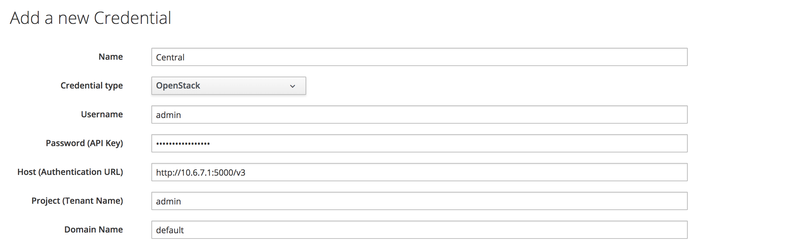
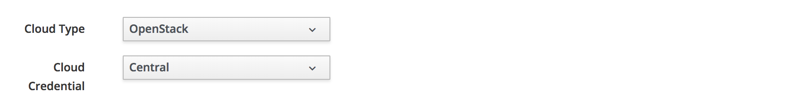

# Using Cloud Credentials

Ansible Cloud Credentials can be defined in the **Automation -> Ansible -> Credentials** section of the WebUI (see screenshot [Adding an OpenStack Cloud Credential](#i1)).



These credentials can then be associated with an embedded Ansible playbook service or method in the creation dialog (see screenshot [Adding Cloud Type and Cloud Credential to a Method](#i1)).



When a cloud credential is associated with a playbook service or method in this way, the cloud credential values are made available to the playbook via environmental variables, although the format of these is different for the various types of cloud credential. 

For an OpenStack cloud credential an environment variable called `OS_CLIENT_CONFIG_FILE` is used. This contains the filename of a temporary YAML file such as _/tmp/awx\_977\_foAfn4/tmpu0gAQG_ written by the embedded Ansible engine. The contents of the YAML file are similar to the following:


``` yaml
clouds:
  devstack:
    auth:
      auth_url: http://10.6.7.1:5000/v3
      username: admin
      password: **********
      project_name: default
```

The YAML file can be loaded into the Ansible variable space using the `OS_CLIENT_CONFIG_FILE` variable, as follows:


``` yaml
- hosts: all
  gather_facts: false
  vars:
    config_file: "{{ lookup('env', 'OS_CLIENT_CONFIG_FILE') }}"

  tasks:
    - debug: msg="{{ config_file }}"
    - stat: path="{{ config_file }}"
      register: st
    - include_vars: "{{ config_file }}"
      when: st.stat.exists and st.stat.isreg

    - name: "Print out clouds variable"
      debug: msg="{{ clouds|default('No clouds found') }}"
```

The output from the `debug` task would be similar to the following: 

```
TASK [Print out clouds variable] ***********************************************
ok: [localhost] => {
    "msg": {
        "devstack": {
            "auth": {
                "auth_url": "http://10.6.7.1:5000/v3",
                "domain_name": "default",
                "password": "**********",
                "project_name": "admin",
                "username": "admin"
            }
        }
    }
}
```

> **Note**
> 
> The cloud is always `devstack` in the YAML imported via the `OS_CLIENT_CONFIG_FILE` variable, regardless of the credential name.

These variables can then be used as normal in the Ansible playbook, for example:

``` yaml
local_action:
  module: nova_compute
  login_username: "{{ clouds.devstack.auth.username }}"
  login_password: "{{ clouds.devstack.auth.password }}"
```

## Accessing Other Cloud Credential Types

Not all cloud credentials are passed via the OS\_CLIENT\_CONFIG\_FILE variable. For example the individual VMware cloud credential fields are passed as separate environment variables, for example:

```
"ansible_env": {
...
    "VMWARE_HOST": "vcenter01",
    "VMWARE_PASSWORD": "password",
    "VMWARE_USER": "admininstrator@vsphere.local",
    "VMWARE_VALIDATE_CERTS": "False",
```

These can be accessed from the `ansible_env` hash, for example: `{{ ansible_env.VMWARE_HOST }}`

> **Tip**
> 
> 
> 
The `ansible_env` hash contains all environment variables accessible to the running playbook.

## Summary

This chapter has shown how cloud credentials can be securely stored and retrieved at run-time by an embedded Ansible playbook service or method.

## Further Reading

[Credentials](https://docs.ansible.com/ansible-tower/latest/html/userguide/credentials.html)

[Utilizing Cloud Credentials](https://docs.ansible.com/ansible-tower/latest/html/userguide/job_templates.html#ug-cloudcredentials)

[Why do I Receive Errors "Could not find a suitable endpoint for client version: 3" When Using Keystone v3 and Ansible Openstack Modules?](https://access.redhat.com/solutions/3295781)