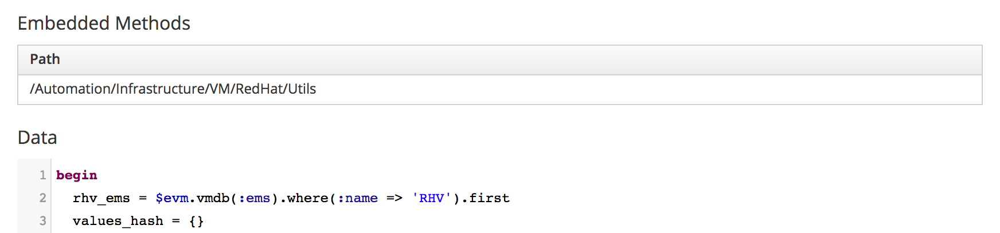

# Embedded Method Example

Embedded methods are particularly useful if a set of reusable _library_ methods each need several supporting methods to implement their functionality. The supporting methods do not need to be made visible to the caller Automate method.

The following is an example of such an embedded method definition. It has only two callable public methods, `vnic_profile` and `vnic_profiles`, however these both use the functionality of the _ovirtsdk4_ gem to communicate with a RHV Manager, and therefore require several private methods to setup the connection and manage the ovirtsdk services.

The embedded class is written with an initializer to allow the caller to pass in the object or ID identifying the RHV provider with which to communicate (there could be multiple RHV providers in a system).

The embedded method is as follows:

``` ruby
#
# Utility library for Red Hat Virtualization
#
require 'ovirtsdk4'

module Automation
  module Infrastructure
    module VM
      module RedHat
        class Utils
          
          def initialize(ems, handle = $evm)
            @handle         = handle
            @ems            = ems_to_service_model(ems)
            @connection     = connection(@ems)
          end          

          def vnic_profile(profile_name, network_name, dc_name)
            vnic_profile = vnic_profiles_service.list.select { |profile| 
              (profile.name == profile_name) && 
              (profile.network.id == network_by_name(network_name, dc_name).id)
            }.first
            vnic_profile
          end

          def vnic_profiles(dc_name)
            profiles = []
            vnic_profiles_service.list.each do |vnic_profile|
              network = network_by_id(vnic_profile.network.id, dc_name)
              profiles << {:id => vnic_profile.id, :name => "#{vnic_profile.name} (#{network.name})"}
            end
            profiles
          end
      
          private
      
          def ems_to_service_model(ems)
            raise "Invalid EMS" if ems.nil?
            # ems could be a numeric id or the ems object itself
            unless ems.is_a?(DRb::DRbObject) && /Manager/.match(ems.type.demodulize)
              if /^\d{1,13}$/.match(ems.to_s)
                ems = @handle.vmdb(:ems, ems)
              end
            end
            ems
          end

          def network_by_name(name, dc_name)
            networks(dc_name).detect { |n| n.name == name }
          end

          def network_by_id(id, dc_name)
            networks(dc_name).detect { |n| n.id == id }
          end

          def networks(dc_name)
            @connection.follow_link(dc(dc_name).networks)
          end

          def dc(name)
            dcs_service.list(search: "name=#{name}").first
          end
      
          def vnic_profiles_service
            @connection.system_service.vnic_profiles_service
          end

          def dcs_service
            @connection.system_service.data_centers_service
          end
                
          def connection(ems)
            connection = OvirtSDK4::Connection.new(
              url: "https://#{ems.hostname}/ovirt-engine/api",
              username: ems.authentication_userid,
              password: ems.authentication_password,
              insecure: true)
            connection if connection.test(true)
          end

        end
      end
    end
  end
end
```

## Invoking the Embedded Methods

The embedded method path is first added to the definition of the Automate method that is to invoke the library methods (see screenshot [Embedded Method](#i1)).



The two public methods are then available for use. The `vnic_profiles` method could be invoked from a dynamic dialog element method to list all vNIC Profiles, as follows:

``` ruby
begin
  rhv_ems = $evm.vmdb(:ems).where(:name => 'RHV').first
  values_hash = {}
  values_hash['!'] = '** no vNIC profiles found **'
  
  # Call the embedded method
  rhv  = Automation::Infrastructure::VM::RedHat::Utils.new(rhv_ems)
  vnic_profiles = rhv.vnic_profiles('DefaultDC')
  
  unless vnic_profiles.empty?
    values_hash['!'] = '-- select from list --'
      vnic_profiles.each do | profile |
      values_hash[profile[:id]] = profile[:name]
    end
  end

  list_values = {
    'sort_by'    => :value,
    'data_type'  => :string,
    'required'   => true,
    'values'     => values_hash
  }
  list_values.each { |key, value| $evm.object[key] = value }

 rescue => err
  $evm.log(:error, "[#{err}]\n#{err.backtrace.join("\n")}")
  exit MIQ_STOP

end
```

The `vnic_profile` method could be invoked to retrieve a vNIC Profile to subsequently use in a call to `create_provision_request`, as follows:


``` ruby
rhv_ems = $evm.vmdb(:ems).where(:name => 'RHV').first

# Call the embedded method
rhv = Automation::Infrastructure::VM::RedHat::Utils.new(rhv_ems)
vnic_profile_id = rhv.vnic_profile('ovirtmgmt', 'rhevm', 'DefaultDC').id

# arg1 = version
args = ['1.1']
# arg2 = templateFields
args << {'name'         => 'rhel72-generic',
         'request_type' => 'template'}
# arg3 = vmFields
args << {'vm_name'       => vm_name,
         'number_of_vms' => '1',
         'vlan'          => vnic_profile_id}
# arg4 = requester
args << {'owner_email'      => 'pemcg@redhat.com',
         'owner_first_name' => 'Peter',
         'owner_last_name'  => 'McGowan'}
# arg5 = tags
args << nil
# arg6 = additionalValues (ws_values)
args << nil
# arg7 = emsCustomAttributes
args << nil
# arg8 = miqCustomAttributes
args << nil
request_id = $evm.execute('create_provision_request', *args)
```

## Summary

This chapter has shown how an embedded method can be used to encapsulate private or support code but still expose useful public library methods that can be invoked externally. Prior to the advent of embedded methods the connection and service methods would have needed to be defined in any Automate method that used the functionality of the _ovirtsdk4_ gem. 