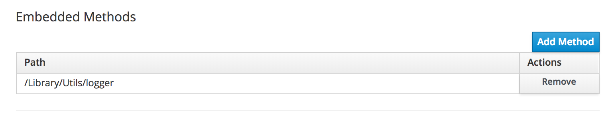
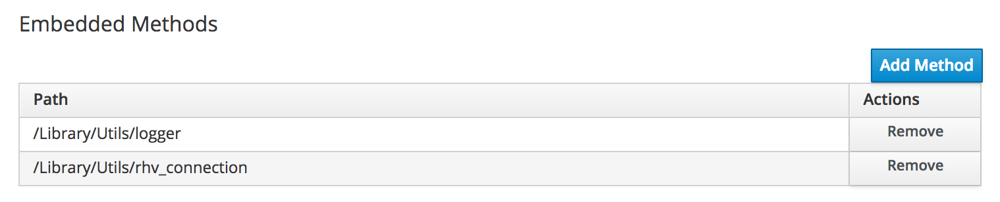

# Embedded Methods

A useful new feature with CloudForms 4.6 (ManageIQ *Gaprindashvili*) is the ability to be able to create reusable libraries of Ruby automation methods, and include (_embed_) these into other Ruby methods to use. This promotes code re-use, makes methods smaller, avoids code duplication, and simplifies testing.

## Calling an Embedded Method

An embedded method must be added to a calling method's definition in the WebUI before it can be used. In the **Embedded Methods** section of the Automate method editor screen, click the **Add Method** button and browse to the location of the method to embed (see [Adding an Embedded Method](#i1)).



Once the embedded method has been added, any of its contained methods are available for the calling method to use.

## Writing an Embedded Method

Embedded methods (often called _library_ methods) can be written in several different ways, depending on their intended use. Some use the nested module structure described in [Defining Automate Methods as Classes](../miscellaneous_updates/chapter.md#h1), and as classes containing class methods, although this is not mandatory. Each style of writing has its advantages. The most common styles are as follows.

### Class With Initializer

Encapsulating the embedded methods in a class with its own initializer allows the class to be unit tested by allowing the injection of a mock `$evm` into the `@handle` variable, as follows:

``` ruby
module Bit63
  module Automate
    module Library
      module Utils
        class Logger
        
          def initialize(handle = $evm)
            @handle = handle
          end
          
          def log(level, msg)
            @handle.log(level, "(location: #{caller_locations(1,1)[0].label}) #{msg}")
          end
          
          def dump_root
            log("info", "Listing $evm.root Attributes - Begin")
            @handle.root.attributes.sort.each { |k, v| log("info", "   Attribute - #{k}: #{v}") }
            log("info", "Listing $evm.root Attributes - End")
          end
          
        end
      end
    end
  end
end
```

Embedded methods written in this way can be invoked in a calling method as follows:

``` ruby
logger = Bit63::Automate::Library::Utils::Logger.new()
logger.log(:info, "Some text")
logger.dump_root
```

### Class Without Initializer

If no unit testing is to be performed on the embedded method then it can be written as a straightforward class method, as follows:

``` ruby
module Bit63
  module Automate
    module Library
      module Utils
        class Logger
        
          def self.log(level, msg)
            $evm.log(level, "(location: #{caller_locations(1,1)[0].label}) #{msg}")
          end
          
          def self.dump_root
            log("info", "Listing $evm.root Attributes - Begin")
            $evm.root.attributes.sort.each { |k, v| log("info", "   Attribute - #{k}: #{v}") }
            log("info", "Listing $evm.root Attributes - End")
          end
          
        end
      end
    end
  end
end
```

These embedded methods can be invoked in the following way in a calling method:

``` ruby
Bit63::Automate::Library::Utils::Logger.log(:info, "Some text")
Bit63::Automate::Library::Utils::Logger.dump_root
```

### Mixin

The code could be written as a _mixin_ without a class, as follows:

``` ruby
module Bit63
  module Automate
    module Library
      module Utils
        
        def log(level, msg)
          $evm.log(level, "(location: #{caller_locations(1,1)[0].label}) #{msg}")
        end
          
        def dump_root
          log("info", "Listing $evm.root Attributes - Begin")
          $evm.root.attributes.sort.each { |k, v| log("info", "   Attribute - #{k}: #{v}") }
          log("info", "Listing $evm.root Attributes - End")
        end

      end
    end
  end
end
```

The calling method must _include_ the embedded module's module path, which imports the embedded methods into its own namespace. The embedded methods can then be invoked without specifying their module path, for example:

``` ruby
include Bit63::Automate::Library::Utils
log(:info, "Some text")
dump_root
```

### Bare Methods

Alternatively the embedded methods can be written as simple bare method definitions, as follows:

``` ruby
def log(level, msg)
   $evm.log(level, "(location: #{caller_locations(1,1)[0].label}) #{msg}")
end

def self.dump_root
  log("info", "Listing $evm.root Attributes - Begin")
  $evm.root.attributes.sort.each { |k, v| log("info", "   Attribute - #{k}: #{v}") }
  log("info", "Listing $evm.root Attributes - End")
end
```
These embedded methods can be invoked in the following way in a calling method:

``` ruby
log(:info, "Some text")
dump_root
```

## Multiple Embedded Methods

More than one embedded method can be added to an Automate method definition, allowing various library methods to be written in separate modules. The Automation Engine combines all of the embedded methods into a single preamble injected into to the Automate method at run-time. Code will execute in the order that it was listed in the embedded methods list (see [Multiple Embedded Methods](#i2)).



> **Note**
> 
> Embedded methods cannot themselves use embedded methods as there is no support for nesting.

## Logging

The use of an embedded method can be traced in _automation.log_. Before an Automate method is launched the Automation Engine will log `Loading embedded method` if any are defined, as follows:

```
...  INFO -- : Invoking [inline] method [/Bit63/Stuff/Methods/test30] with inputs [{}]
-->  INFO -- : Updated namespace [Library/Utils/logger  Bit63/Library]
-->  INFO -- : Loading embedded method Bit63/Library/Utils/logger
...  INFO -- : <AEMethod [/Bit63/Stuff/Methods/test]> Starting
...  INFO -- : <AEMethod test> (location: <main>) Some text
...  INFO -- : <AEMethod test> (location: dump_root) Listing $evm.root Attributes - Begin
...  INFO -- : <AEMethod test> (location: block in dump_root)    Attribute - ae_provider_category: unknown
```

## Summary

The chapter has introduced _embedded methods_, and shown how useful they can be to promote code re-use. They can be written in several different styles to suit the coding and unit testing standards in use in an organisation.

The next chapter shows an example of an embedded method that defines two small reusable methods that each use the RHV SDK to connect to a Red Hat Virtualization Manager.

## Further Reading

[Automate Embedded Methods](http://talk.manageiq.org/t/automate-embedded-methods/3124)

