# Expression Methods

One of the new method types that has been introduced with CloudForms 4.6 (ManageIQ *Gaprindashvili*) is the *expression* method. These use the same advanced search filters that are used in report creation or VM filtering, and are particularly useful for populating service dialog dynamic element drop-down lists. Expression methods require no Ruby knowledge to use, run much faster than traditional Ruby methods, and are fully RBAC-compliant, meaning that a user running the method will only see results that are relevant to themselves.

An example of the use of an expression method might be to populate a dialog drop-down list element with a list of all powered-on VMs on a Red Hat Virtualization provider. This can be achieved as follows.

## Create the Method

An expression method is created in the same way as other automate methods. One of the new method types in CloudForms 4.6 (ManageIQ *Gaprindashvili*) is *expression* (see screenshot [Method Types](#i1)).

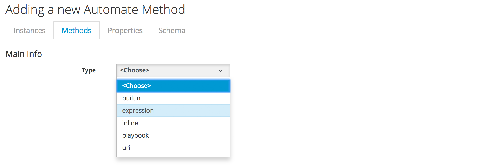
 

Selecting *expression* as the method type opens the expression dialog, where the expression can be defined. For this example the **Expression Object** should be **Vm**, and the following expressions defined:

* **Field → VM and Instance: Type → =** "ManageIQ::Providers::Redhat::InfraManager::Vm" **AND**
* **Field → VM and Instance: Power State → =** "on"

(see screenshot [Defining The Expression Method](#i2)).

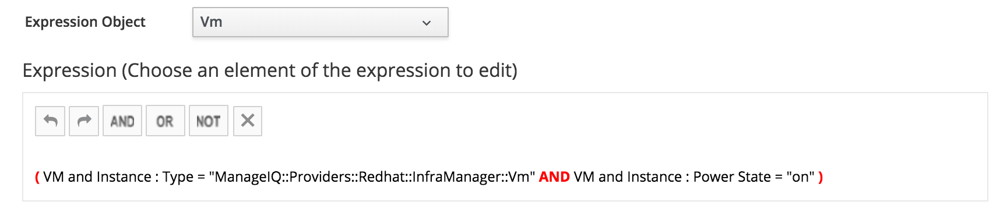 

## Create an Instance

An expression method is still run from the context of an instance, so as when using a Ruby automate method, an instance should be created to run the expression method.

## Testing from Simulation

The default runtime action is for an expression method to return a hash called *values* containing {id ⇒ name} hash pairs for the objects found by the search. This is the correct results format for a service dialog dynamic element method that populates a drop-down list.

The method’s output can be examined by running the instance from **Automate → Simulation**. As when testing a Ruby method from simulation, the method's instance can be invoked by running **System/Process/Request** with the default message, and a **Request** value of **call\_instance**. Three **Attribute/Value** pairs are required by _call\_instance_:

* **namespace** - the namespace containing the instance to test
* **class** - the class containing the instance to test
* **instance** - the instance name to test

(see screenshot [Testing the Expression Method In Simulation](#i3)).

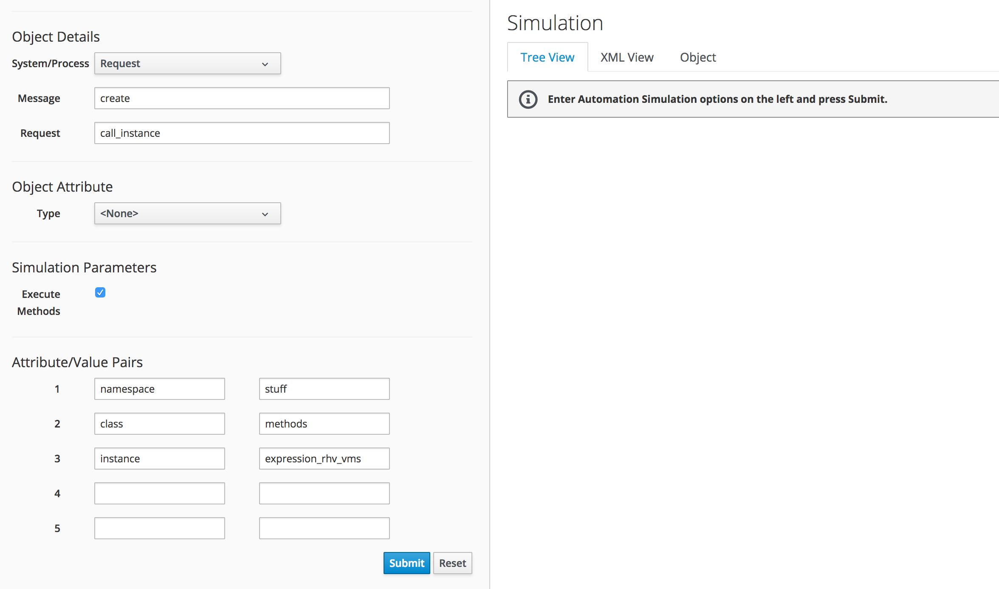 

Once the **Submit** button is clicked the instance is invoked and the results can be expanded in the right-hand pane in the **Tree View** tab. The _values_ hash can be seen and each of its key/value pairs can be examined. (see screenshot [Results of the Expression Method In Simulation](#i3)).

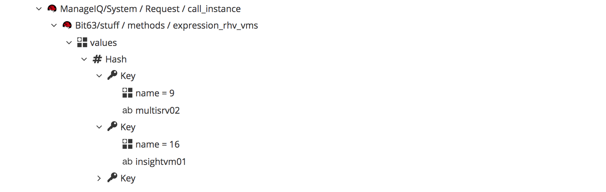 

## Populating a Dynamic Drop-Down Element

Having tested that the expression method returns some meaningful data, we can add the instance as the entry point of a dynamic method to populate a service dialog drop-down list element. If the dialog is run from a button or service, the dynamic element is populated with the list of powered-on VMs on the RHV provider (see screenshot [The Running Service Dialog](#i4)).

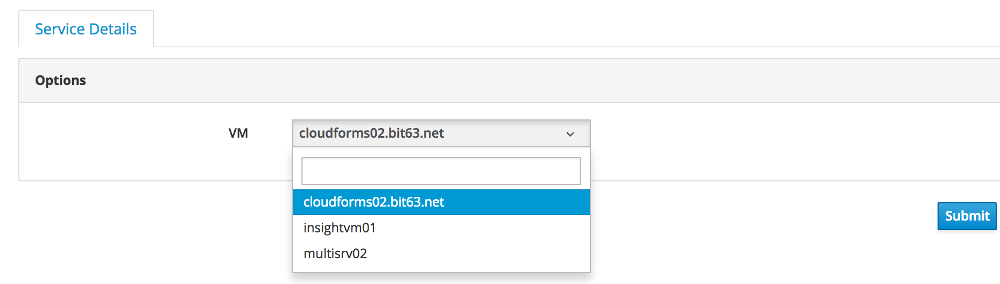 

## Input Parameters

Expression methods can take a number of input parameters that can increase their flexibility. Suppose that our CloudForms installation managed two separate infrastructure providers, but we only wanted to list the powered-on VMs in either one or the other provider, but not both.  

Our expression method can be edited to add a further **AND** field of **Field → VM and Instance : Ems → =**, but with the check box **User will input the value** ticked (see screenshot [Adding a User Input to the Expression](#i5)).

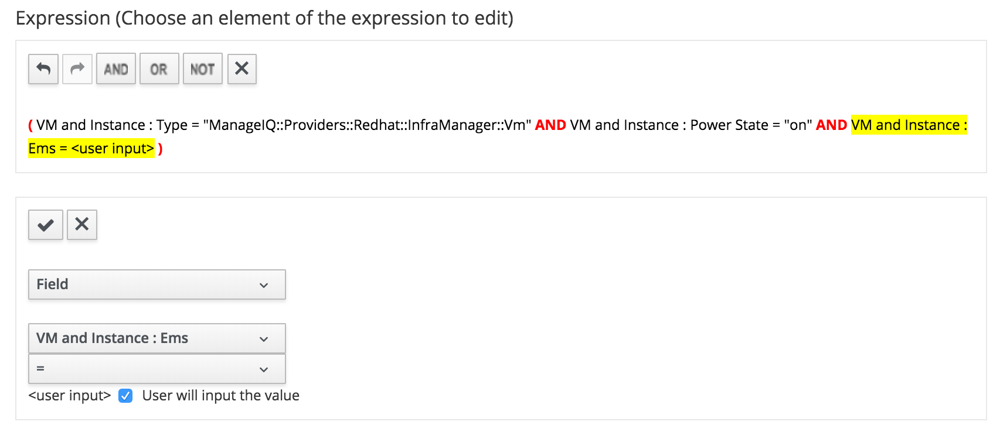

The `<user input>` will be supplied from the results of a new **Provider (EMS)** element in the service dialog.

An input parameter called *arg1* must now be created for the expression method. This should be of type **String**, and with the value `${/#dialog_ems}`. This is the substitution string that represents the `$evm.root['dialog_ems']` value returned from the **Provider (EMS)** dialog element (see screenshot [Adding the Input Parameter](#i6)).

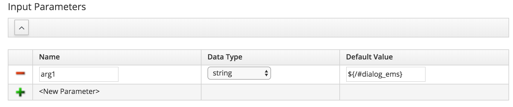

We can edit the service dialog to insert a new drop-down list element with **Label** of _Provider (EMS)_ and a **Name** of _ems_ (also populated by expression method if required), that lists all of the providers on the system. Using the **Fields to refresh** drop-down (see section [Fields to Refresh](../new_service_dialog_editor/chapter.md#fields_to_refresh)) we can trigger the earlier **VM** element running the _expression\_rhv\_vms_ method to run when a provider is selected. 

Now when the modified dialog is run from a button or service, the **Provider (EMS)** element can be selected first, which then triggers the **VM** drop-down to refresh using the `$evm.root['dialog_ems']` (translated as `${/#dialog_ems}`) value as an input parameter (see screenshot [All VMs listed on the Selected Provider](#i7)).

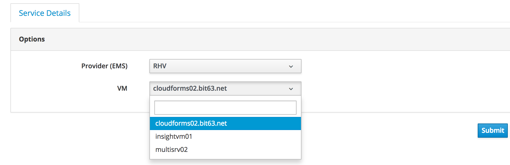  

### Returning an Alternative Key

Several other input parameters can be used. For example if {guid ⇒ name} hash pairs should be returned rather than {id ⇒ name} pairs, an alternative key field can be specified using the _key_ argument (see screenshots [Setting an Alternative Key](#i8) and [Simulation Results From Setting an Alternative Key](#i9)).

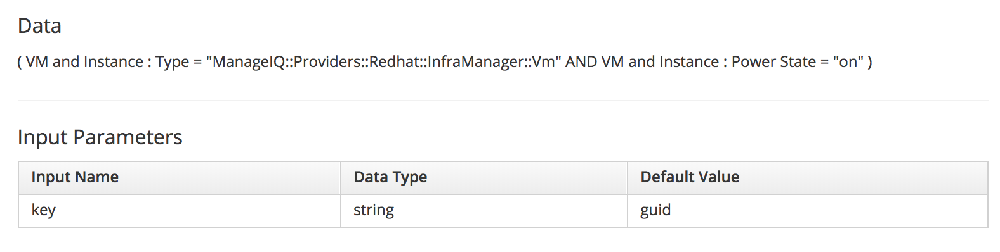

When run from **Automate -> Simulation** the `values` hash now has the following keys:

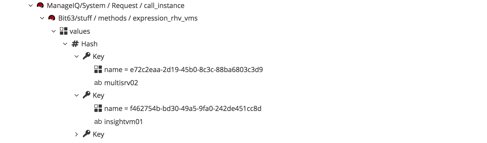

### Returning an Array Rather than Hash

If an array rather than hash should be returned by the expression method, this can also be specified using input parameters (see screenshots [Setting an Alternative Result Type](#i10) and [Simulation Results From Setting an Alternative Result Type](#i11)).

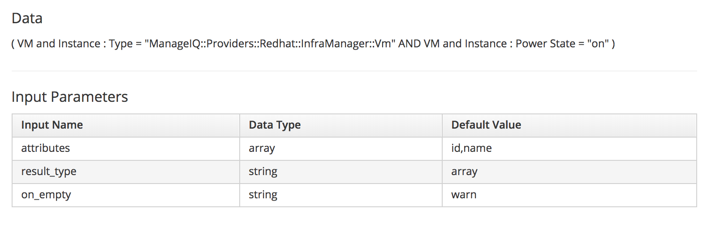

When run from **Automate -> Simulation** it can be seen that `values` is now an array of [id,name] pairs, as follows: 

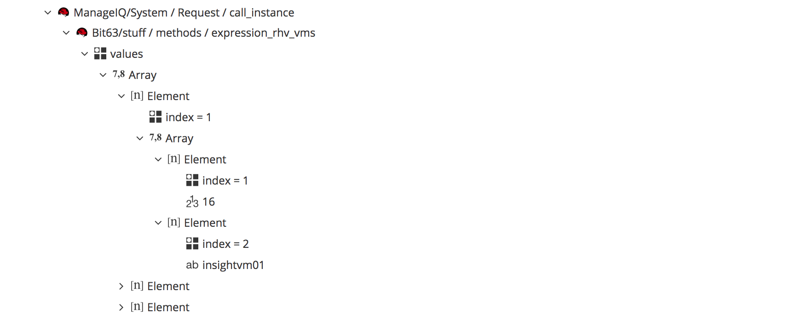

### Using an Alternative Return Attribute Name

The default action of an expression method is to return the results into a hash or array variable called _values_. This is accessible as `$evm.object['values']` from any subsequent Ruby methods run from the same instance.

If several expression methods are to be called from the same instance it can be useful to rename the return attribute from each to keep the result sets unique. This can be done with the _result\_attr_ argument (see screenshot [Using an Alternative Return Attribute Name](#i12))

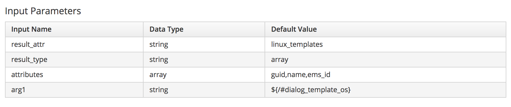

A subsequent Ruby method run from the same instance would see the results as follows:

``` ruby
$evm.object['linux_templates'] = [["5c427ebd-6bde-4c29-a068-caca7c69519f", "RedHat_CFME-5.8.0.17", 1],...]
```

### Summary of Input Parameters

  - **arg1**, **arg2**, **argn** - the first, second, n’th arguments in the expression

  - **attributes** - a comma delimited list of attributes to select from the resultant objects. The **Data Type** should be "array". If **result\_type** is the default (hash) then only one attribute from the attributes list is returned. If **result\_type** is 'array' then all are returned.

  - **distinct** - a comma delimited list of attributes which are distinct in the resultant objects (i.e. duplicates removed). The **Data Type** should be "array".

  - **key** - the attribute to use for the key (default: 'id').

  - **result\_obj**  - the object where the result data should be stored (default: '.' (current object (aka `$evm.object`))).

  - **result\_attr**  - the name of the attribute which stores the result (default: 'values').

  - **result\_type** - the result type hash or array (default: hash).

  - **on\_empty** - the method behaviour when the search returns an empty list (options: warn | error | abort). The method ends with `$evm.root['ae_result']` set to this value.

  - **default** - the default value in case the result is empty and **on\_empty** is set as **warn**.

## Summary

This chapter has introduced _expression methods_, which retrieve VMDB values from expression-based queries without the overhead of launching a dRuby method. As a result they run much faster than a 'traditional' Ruby method that would otherwise be used to populate a dynamic drop-down service dialog element. They can therefore be used to reduce the overall loading time of a complex service dialog.


## Further Reading

[ManageIQ Talk Forum Discussion of Expression Methods](http://talk.manageiq.org/t/automate-expression-methods/3071)
