# Expression Methods

One of the new method types that has been introduced with CloudForms 4.6
(ManageIQ *Gaprindashvili*) is the *expression* method. These use the
same advanced search filters that are used in report creation or VM
filtering, and are particularly useful for populating service dialog
dynamic element drop-down lists. Expression methods require no Ruby
knowledge to use, run much faster than traditional Ruby methods, and are
fully RBAC-compliant, meaning that a user running the method will only
see results that are relevant to themselves.

An example of the use of an expression method might be to populate a
dialog drop-down list element with a list of all VMs on a Red Hat
Virtualization provider. This can be achieved as follows.

## Create the Method

An expression method is created in the same way as other automate
methods. CloudForms 4.6 (ManageIQ *Gaprindashvili*) has added two more
method types, one of which is *expression* (see
[Method Types](#i1))

[//]: # ()
_-- screenshot here 'Method Types' --_
​  

Selecting *expression* as the method type opens the expression dialog,
where the expression can be defined. For this example the **Expression
Object** should be **Vm**, and the expression **Field → VM and Instance
: Type → =** should be selected, to match with the string
"ManageIQ::Providers::Redhat::InfraManager::Vm" (see
[Defining The Expression Method](#i2))

[//]: # (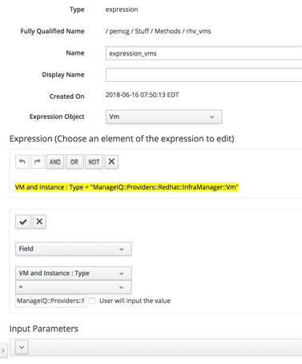)
_-- screenshot here 'Defining The Expression Method' --_
​  

## Create an Instance

An expression method is still run from the context of an instance, so as
when using a Ruby automate method, an instance should be created to run
the expression method (see
[The Expression Method with Associated Instance](#i3))

[//]: # (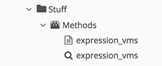)
_-- screenshot here 'The Expression Method with Associated Instance' --_
​  

## Testing from Simulation

The default runtime action is for an expression method to return a hash
called *values* containing {id ⇒ name} hash pairs for the objects found
by the search. This is the correct format that a service dialog dynamic
element method needs to populate the drop-down list.

The method’s output can be examined by running the instance from
**Automate → Simulation** (see [Results of the Expression Method In Simulation](#i4)).

[//]: # (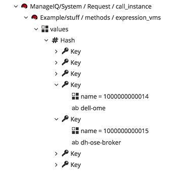)
_-- screenshot here 'Results of the Expression Method In Simulation' --_
​  

## Populating a Dynamic Drop-Down Element

Having tested that the expression method returns some meaningful data,
we can add the instance as the entry point of a dynamic method to
populate a service dialog drop-down list element (see
[Setting the Dynamic Method Entry Point in the Element
Definition](#i5)).

[//]: # (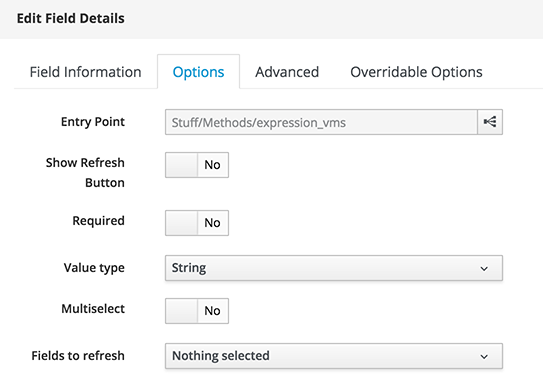)
_-- screenshot here 'Setting the Dynamic Method Entry Point in the Element Definition' --_
​  

If the dialog is run from a button or service, the dynamic element is
populated with the list of VMs on the RHV provider (see
[The Running Service Dialog](#i6)).

[//]: # (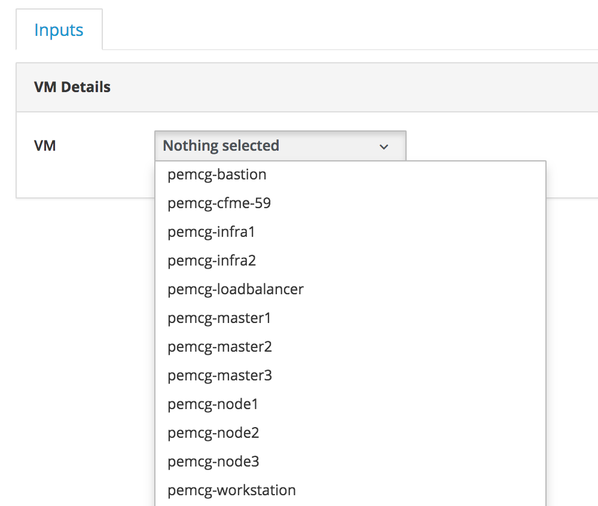)
_-- screenshot here 'The Running Service Dialog' --_
​  

## Input Arguments

Expression methods can take a number of input arguments which can
increase their flexibility. Suppose that our CloudForms installation
managed two separate RHV installations, but we only wanted to list VMs
in either one or the other provider, but not both.

We can edit the service dialog to insert a new drop-down list element
with **Label** of *Provider* and a **Name** of *ems* (also populated by
expression method if required), that lists all of the RHV providers on
the system. Using the **Fields to refresh** drop-down we can trigger the
earlier **VM** element running the *expression\_vms* method to run when
a provider is selected (see [Setting the Provider Element to Refresh the VM
Element](#i7))

[//]: # (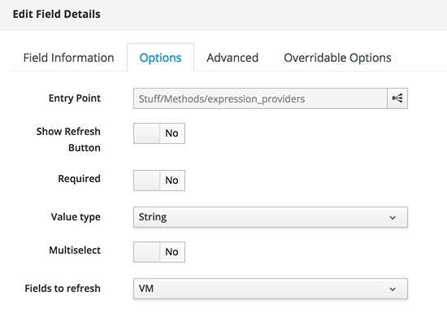)
_-- screenshot here 'Setting the Provider Element to Refresh the VM Element' --_
​  

The *expression\_vms* method can then be edited to add an **AND** field
of **Field → VM and Instance : Ems → =**, but with the check box **User
will input the value** ticked (see [Adding a Second Filter to the Expression](#i8)).

[//]: # (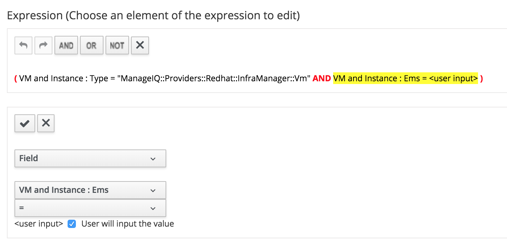)
_-- screenshot here 'Adding a Second Filter to the Expression' --_
​  

The `<user input>` will be supplied from the results of the new **Provider** element.

An input parameter called *arg1* must now be created for the expression
method. This should be of type **String**, and with the value
`${/#dialog_ems}`. This is the substitution string that represents the
`$evm.root['dialog_ems']` value returned from the **Provider** dialog
element (see [Adding the Input Parameter](#i9))

[//]: # (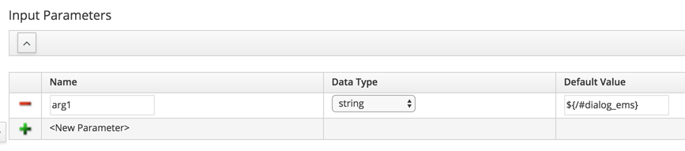)
_-- screenshot here 'Adding the Input Parameter' --_
​  

Now when the modified dialog is run from a button or service, the
**Provider** element can be selected first, which then triggers the
**VM** drop-down to refresh with a the list of VMs on the selected
provider (see [All VMs listed on the Selected Provider](#i10)).

[//]: # (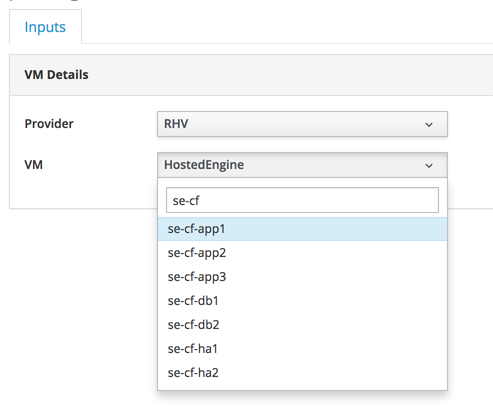)
_-- screenshot here 'All VMs listed on the Selected Provider' --_
​  

Several other input arguments can be used. For example if {guid ⇒ name}
hash pairs should be returned rather than {id ⇒ name} pairs, an
alternative key field can be specified using the *key* argument (see
[Setting an Alternative Key](#i11) and [Simulation Results](#i12)).

[//]: # ()
_-- screenshot here 'Setting an Alternative 'guid' Key' --_
​  

[//]: # (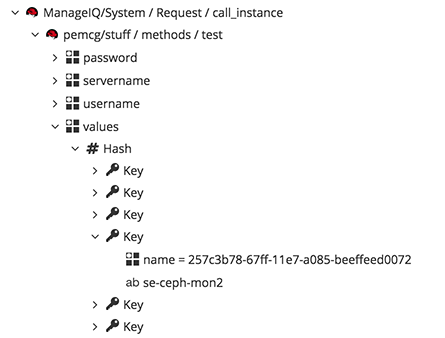)
_-- screenshot here 'Simulation Results using 'guid' Key' --_
​  

If an array rather than hash should be returned by the expression method, this can also be specified using input parameters (see
[Setting an Alternative Result Type](#i13) and [Simulation Results](#i14)).

[//]: # (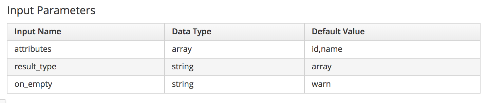)
_-- screenshot here 'Setting an Alternative Result Type of 'array' and attributes 'id,name'' --_
​  

[//]: # (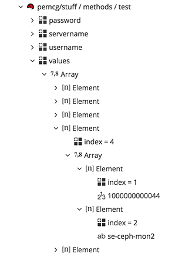)
_-- screenshot here 'Simulation Results using Alternative Result Type of 'array' and attributes 'id,name'' --_
​  

### Summary of arguments

  - **arg1**, **arg2**, **argn** The first, second, n’th arguments in
    the expression

  - **attributes** A comma delimited list of attributes to select from
    the resultant objects. If **result\_type** is the default (hash)
    then only one attribute from the attributes list is returned. If
    **result\_type** is 'array' then all are returned

  - **distinct** A comma delimited list of attributes which are distinct
    in the resultant objects (i.e. duplicates removed)

  - **key** The input parameter to specify what to use for the key
    (default: 'id')

  - **result\_obj** The object where the result data should be stored
    (default: current object)

  - **result\_attr** The name of the attribute which stores the result
    (default: 'values')

  - **result\_type** The result type hash or array (default: hash)

  - **on\_empty** The method behaviour when the search returns an empty
    list (options: warn | error | abort). The method ends with
    $evm.root\['ae\_result'\] set to this value.

  - **default** The default value in case the result is empty and you
    select warn

## References

[Stackissue Discussion of Expression Methods](http://stackissue.com/ManageIQ/manageiq/wip-automate-expression-methods-6655.html)

[ManageIQ Talk Forum Discussion of Expression Methods](http://talk.manageiq.org/t/automate-expression-methods/3071)
