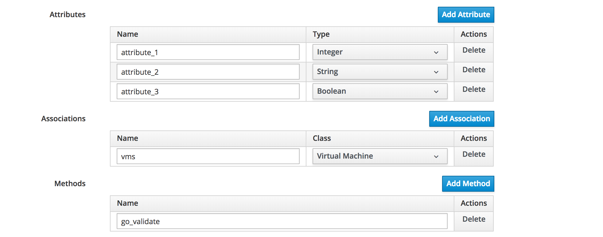

# Generic Objects

Generic Objects are a very useful new feature of CloudForms 4.6 (ManageIQ *Gaprindashvili*). They allow us to create custom object classes to represent objects that we may work with, but might not necessarily be represented by an out-of-the-box CloudForms / ManageIQ object. An example might be a load balancer, or a firewall group.

> **Note**
> 
> Generic Objects are also known by their Red Hat marketing name of *Dynamic Resource Objects*

## Generic Object Definition

A Generic Object comprises a class definition and one or more instances of that class. The class definition is created from the **Generic Object Classes** accordion of the **Automation -> Automate -> Generic Objects** page in the WebUI. Clicking on the **Configuration** button reveals the option **Add a new Generic Object Class**. 

A Generic Object definition consists of a number of attributes, associations and methods.



### Attributes

One or more attributes for the Generic Object class can be added. Atrributes can be of the following types:

* Boolean
* Date/Time
* Float
* Integer
* String
* Time


### Associations

One or more associations to other object types (including other generic objects) can be added if required.

### Methods

One or more methods can be defined if required. There must also be a matching entry in the automation datastore under: _/GenericObject_ for the associated methods.

[//]: # ()

_-- screenshot here 'Generic Object Methods in the Automation Datastore' --_

## Creating Dynamic Resource Definitions from the API

``` yaml
---
- hosts: localhost

 tasks:
 - name: Create Dynamic Resource Object definition
   uri:
     url: "https://localhost/api/generic_object_definitions"
     method: POST
     user: admin
     password: "{{ password }}"
     validate_certs: no
     headers:
       Content-Type:  application/json
     body_format: json
     body:
       action: create
       name: "{{ name }}"
       properties:
         attributes:
           engine: string
           type: string
           size: integer
           region: string
           username: string
         associations:
           service: Service
           provider: ManageIQ::Providers::CloudManager
```

## Creating a Generic Object from the Definition

Once the Generic Object class has been defined, new instances can created from the definition.

From Ruby:

``` ruby
go_class = $evm.vmdb(:generic_object_definition).find_by_name("My GO Class")
new_go = go_class.create_object(:name => "Test GO",
                             :attribute_1 => 1,
                             :attribute_2 => "test",
                             :attribute_3 => true)
vm = $evm.vmdb(:vm).find_by_name('pemcg-test')
new_go.vms = [vm]
new_go.save!

```


From Ansible:


``` yaml
  vars:
  - goc_name: "{{ 'My GO Class'|urlencode }}"
  - new_go_name: "Test GO"

  tasks:
  - name: Find the Generic Object Class definition
    uri:
      url: "{{ manageiq.api_url }}/api/generic_object_definitions?expand=resources&filter[]=name='{{ goc_name }}'"
      method: GET
      validate_certs: no
      headers:
        X-Auth-Token: "{{ manageiq.api_token }}"
      body_format: json
    register: go_class
    
  - set_fact:
      go_class_href: "{{ go_class.json.resources[0].href }}"

  - name: Create the new Generic Object from the definition
    uri:
      url: "{{ manageiq.api_url }}/api/generic_objects"
      method: POST
      validate_certs: no
      headers:
        X-Auth-Token: "{{ manageiq.api_token }}"
      body_format: json
      body:
        action: create
        name: "{{ new_go_name }}"
        generic_object_definition:
          href: "{{ go_class_href }}"
        property_attributes:
          attribute_1: "{{ value_1 }}"
          attribute_2: "{{ value_2 }}"
          attribute_3: "{{ value_3 }}"
        associations:
          vms:
          - href: "{{ vm_href }}"
    register: new_go
    
  - set_fact:
      new_go_href: "{{ new_go.json.results[0].href }}"
```

## Displaying Generic Objects

Although generic objects are useful to work with from automate "behind the scenes", they can only be viewed 

     |    |    $evm.root['new_go'].add_to_service
     |    |    $evm.root['new_go'].remove_from_service


## Custom Buttons on Generic Objects

Custom buttons can be assigned to generic objects.

## Returning Data from Generic Object Methods

something like this: x=my_dro.get_me_my_value

Greg McCullough @gmcculloug Jun 19 18:24
@CCoupel store the value you want to return in the root object as method_result
https://github.com/ManageIQ/manageiq/blob/master/app/models/generic_object.rb#L201

## Deleting Generic Objects

There is currently no way of deleting an instance of a generic object class via the WebUI. This must be done from automate using the `remove_from_vmdb` method on the generic object itself, or from the API by POSTing the following body to the RESTful URI of the generic object:

``` json
{
  "action": "delete"
}
```

Generic Objects aren't automatically deleted when a service containing them is retired, even if the **Remove Resources** option set to 'Yes' in the service's **Retirement** tab. In the context of service retirement, only a VM is considered a resource (VMs have their own retirement state machine/workflow).
 
Fortunately a simple retirement Ansible playbook such as the following will delete all Generic Objects associated with the service.

``` yaml
---
- name: Delete the service's generic objects
  hosts: localhost

  tasks:

  - name: Find the generic objects that belong to this service
    uri:
      url: "{{ manageiq.api_url }}/api/{{ manageiq.service }}?attributes=generic_objects"
      method: GET
      validate_certs: no
      headers:
        X-Auth-Token: "{{ manageiq.api_token }}"
      body_format: json
    register: service
    
  - set_fact:
      generic_objects: "{{ service.json.generic_objects }}"
      
  - name: Remove the resources from the service
    uri:
      url: "{{ manageiq.api_url }}/api/{{ manageiq.service }}"
      method: POST
      validate_certs: no
      headers:
        X-Auth-Token: "{{ manageiq.api_token }}"
      body_format: json
      body:
        action: remove_resource
        resource:
          resource:
            href: "{{ item.href }}"
    with_items: "{{ generic_objects }}"
  
  - name: Delete the generic objects
    uri:
      url: "{{ item.href }}"
      method: POST
      validate_certs: no
      headers:
        X-Auth-Token: "{{ manageiq.api_token }}"
      body_format: json
      body:
        action: delete
    with_items: "{{ generic_objects }}"
```

## Summary


## References


