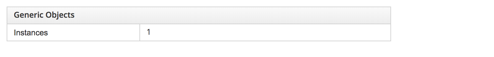
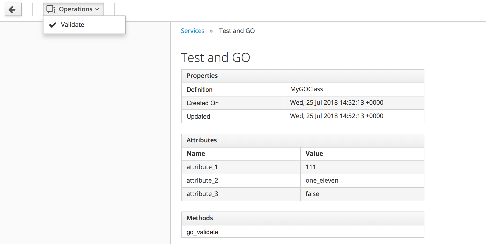

# Generic Objects

Generic Objects are a very useful new feature of CloudForms 4.6 (ManageIQ *Gaprindashvili*). They allow us to create custom object classes to represent objects that we may work with, but might not necessarily be represented by an out-of-the-box CloudForms / ManageIQ object. An example might be a load balancer, or a firewall group.

> **Note**
> 
> Generic Objects are also known by their Red Hat marketing name of *Dynamic Resource Objects*

## Generic Object Definition

A Generic Object comprises a class definition and one or more instances of that class. The class definition is created from the **Generic Object Classes** accordion of the **Automation -> Automate -> Generic Objects** page in the WebUI. Clicking on the **Configuration** button reveals the option **Add a new Generic Object Class**. 

A Generic Object definition consists of a number of attributes, associations and methods (see [Adding a new Generic Object Class](#i1)).


### Name / Description

The generic object class name and description can be any free-form text, however if the generic object is to have methods, the class name should be compatible with the automate datastore class naming conventions (i.e. no spaces).

### Attributes

One or more attributes for the Generic Object class can be added. Atrributes can be of the following types:

* Boolean
* Date/Time
* Float
* Integer
* String
* Time

### Associations

One or more associations to other object types (including other generic objects) can be added if required.

### Methods

One or more methods can be specified in the class definition if required. The methods themselves are defined in the Automate Datastore in a generic object-specific class under _/GenericObject/ClassName_. The methods and their associated instances must be named as they appear in the generic object class definition (see ...)


Method names should not clash with existing Rails Active Record method names, for example a method called `validate` already exists, and so `go_validate` is used in this example.

> **Note**
> 
> The _Example_ class from the _ManageIQ_ domain can be copied and used as a template for the generic object class. This is a simple state machine with 4 states:
> 
> * pre
> * execute
> * check_execute
> * post
> 

The completed _go\_validate_ instance is shown in [Completed _go\_validate_ Instance](#i2).


## Creating Generic Object Definitions from the API

In addition to creating a generic object class definition using the WebUI, a class definition can be created by POSTing to the RESTful API, as follows:

``` yaml
---
  tasks:
  - name: Create Generic Object Definition
    uri:
      url: "https://localhost/api/generic_object_definitions"
      method: POST
      user: admin
      password: "{{ password }}"
      validate_certs: no
      headers:
        Content-Type:  application/json
      body_format: json
      body:
        action: create
        name: MyGOClass
        properties:
          attributes:
            attribute_1: integer
            attribute_2: string
            attribute_3: boolean
          associations:
            service: vms
            provider: Vm
```

## Creating a Generic Object from the Definition

Once the Generic Object class has been defined, new instances can created from the definition. The following examples illustrate how to do this from Ruby and Ansible:

From Ruby:

``` ruby
go_class = $evm.vmdb(:generic_object_definition).find_by_name("MyGOClass")
new_go = go_class.create_object(:name => "Test and GO",
                                :attribute_1 => 1,
                                :attribute_2 => "test",
                                :attribute_3 => true)
vm = $evm.vmdb(:vm).find_by_name('pemcg-test')
new_go.vms = [vm]
new_go.save!

```

From Ansible:

``` yaml
  vars:
  - goc_name: "{{ 'My GO Class'|urlencode }}"
  - new_go_name: "Test GO"

  tasks:
  - name: Find the Generic Object Class definition
    uri:
      url: "{{ manageiq.api_url }}/api/generic_object_definitions?expand=resources&filter[]=name='{{ goc_name }}'"
      method: GET
      validate_certs: no
      headers:
        X-Auth-Token: "{{ manageiq.api_token }}"
      body_format: json
    register: go_class
    
  - set_fact:
      go_class_href: "{{ go_class.json.resources[0].href }}"

  - name: Create the new Generic Object from the definition
    uri:
      url: "{{ manageiq.api_url }}/api/generic_objects"
      method: POST
      validate_certs: no
      headers:
        X-Auth-Token: "{{ manageiq.api_token }}"
      body_format: json
      body:
        action: create
        name: "{{ new_go_name }}"
        generic_object_definition:
          href: "{{ go_class_href }}"
        property_attributes:
          attribute_1: "{{ value_1 }}"
          attribute_2: "{{ value_2 }}"
          attribute_3: "{{ value_3 }}"
        associations:
          vms:
          - href: "{{ vm_href }}"
    register: new_go
    
  - set_fact:
      new_go_href: "{{ new_go.json.results[0].href }}"
```

##Creating Generic Objects from Services

Although generic objects are useful to work with from automate "behind the scenes", they are most versatile when used in conjunction with services. A Ruby method or Ansible playbook can be called from a service provision state machine to create a generic object using values from a service dialog. The following examples illustrate how this can be done.

From Ruby:


``` ruby
dialog_options = $evm.root['service_template_provision_task'].dialog_options
go_class = $evm.vmdb(:generic_object_definition).find_by_name("MyGOClass")
new_go = go_class.create_object(:name => dialog_options['dialog_go_name'],
                         :attribute_1 => dialog_options['dialog_attribute_1'],
                         :attribute_2 => dialog_options['dialog_attribute_2'],
                         :attribute_3 => true)
vm = $evm.vmdb(:vm, dialog_options['dialog_association_vm'])
new_go.vms = [vm]
new_go.save!
new_go.add_to_service($evm.root['service'])
```

From Ansible:

``` yaml
---
- name: Create Generic Object from Service
  hosts: all

  vars:
  - manageiq_validate_certs: False
  - go_class_name: "{{ 'MyGOClass'|urlencode }}"
    
  tasks:
  - name: Find the generic object class definition
    uri:
      url: "{{ manageiq.api_url }}/api/generic_object_definitions?expand=resources&filter[]=name='{{ go_class_name }}'"
      method: GET
      validate_certs: no
      headers:
        X-Auth-Token: "{{ manageiq.api_token }}"
      body_format: json
    register: go_definition
  
  - name: Create generic object
    uri:
      url: "{{ manageiq.api_url }}/api/generic_objects"
      method: POST
      validate_certs: no
      headers:
        X-Auth-Token: "{{ manageiq.api_token }}"
      body_format: json
      body:
        action: create
        name: "{{ go_name }}"
        generic_object_definition:
          href: "{{ go_definition.json.resources[0].href }}"
        property_attributes:
          attribute_1: "{{ attribute_1 }}"
          attribute_2: "{{ attribute_2 }}"
          attribute_3: "false"
        associations:
          vms:
          - href: "{{ manageiq.api_url }}/api/{{ association_vm }}"
    register: new_go
    
  - name: Add generic object to service
    uri:
      url: "{{ manageiq.api_url }}/api/{{ manageiq.service }}"
      method: POST
      validate_certs: no
      headers:
        X-Auth-Token: "{{ manageiq.api_token }}"
      body_format: json
      body:
        action: add_resource
        resource:
          resource:
            href: "{{ new_go.json.results[0].href }}"
```

The newly provisioned service will be seen to have an instance of a generic object when viewed in the WebUI (see [Generic Object Instances in Services WebUI Page](#i3)).



The link is clickable, and if clicked will navigate to a page displaying an overview of all generic objects associated with the service (see [Generic Object Details from Services WebUI Page](#i4)).


Further details about each generic object are available by clicking on the individual object's link.

> **Note**
> 
> When navigating to the details of a generic object from the **Services** page in the WebUI, the **Service** page RBAC will not show any associations of that generic object. Associations are only visible when viewing the generic object details from **Automation -> Automate -> Generic Objects**

## Generic Object Methods

Generic object methods can be run from another automate method, as follows: 

``` ruby
go = $evm.vmdb(:GenericObject).where(:name => "Test and GO").first
go.go_validate
```

They can also be triggered from the RESTful API, for example by POSTing a json body specifying an `action` to the RESTful URI of the generic object:

``` json
{
  "action": "go_validate"
}
```

> **Note**
> 
> POSTing an action to a generic object can run either the generic object's named method, or a button with that name on the generic object. If both a button and method exist with the same name, the button's method will be run.

### Returning Values from Generic Object Methods

Values can be returned from a generic object method to a calling method via `$evm.root['method_result']` in the called method. For example we could define a method called `get_attr1` for a generic object as follows: 

``` ruby
this_go = $evm.root['generic_object']
attr_1 = this_go.attributes['properties']['attribute_1']
$evm.root['method_result'] = attr_1
```

This could be called from another Ruby automate method to retrieve the `attribute_1` value from the generic object instance, like so:

``` ruby
attr1 = go.get_attr1
```

## Custom Buttons on Generic Objects

Generic object methods can also be run from custom buttons applied to the **Generic Object** object type. When creating a button the **Advanced** tab object details should specify **GenericObject** in the **System/Process** drop-down, and an Attribute of **method_name** should be defined with the Value being the name of the generic object's method to run (see [Custom Button Definition](#i5)).


The custom button group and button is then visible from the generic object details page (see [Custom Button on a Generic Object](#i6)).



> **Note**
> 
> Custom buttons on generic objects are currently only visible when the generic object details are displayed from the **Services** page in the WebUI, and not when viewing the generic object from the **Automation -> Automate -> Generic Objects** menu (see: [Bugzilla](https://bugzilla.redhat.com/show_bug.cgi?id=1518187) for further details).
> 
> Custom buttons on generic objects cannot currently display service dialogs when invoked (see [Bugzilla](https://bugzilla.redhat.com/show_bug.cgi?id=1595213) for further details).

## Deleting Generic Objects

There is currently no way of deleting an instance of a generic object class via the WebUI. This can be done from automate using the `remove_from_vmdb` method on the generic object itself, or from the API by POSTing the following body to the RESTful URI of the generic object:

``` json
{
  "action": "delete"
}
```

Generic Objects aren't automatically deleted when a service containing them is retired, even if the **Remove Resources** option set to 'Yes' in the service's **Retirement** tab. In the context of service retirement, only a VM is considered a resource (VMs have their own retirement state machine/workflow).
 
Fortunately a simple retirement Ansible playbook such as the following will delete all generic objects associated with the service.

``` yaml
---
- name: Delete the service's generic objects
  hosts: localhost

  tasks:

  - name: Find the generic objects that belong to this service
    uri:
      url: "{{ manageiq.api_url }}/api/{{ manageiq.service }}?attributes=generic_objects"
      method: GET
      validate_certs: no
      headers:
        X-Auth-Token: "{{ manageiq.api_token }}"
      body_format: json
    register: service
    
  - set_fact:
      generic_objects: "{{ service.json.generic_objects }}"
      
  - name: Remove the resources from the service
    uri:
      url: "{{ manageiq.api_url }}/api/{{ manageiq.service }}"
      method: POST
      validate_certs: no
      headers:
        X-Auth-Token: "{{ manageiq.api_token }}"
      body_format: json
      body:
        action: remove_resource
        resource:
          resource:
            href: "{{ item.href }}"
    with_items: "{{ generic_objects }}"
  
  - name: Delete the generic objects
    uri:
      url: "{{ item.href }}"
      method: POST
      validate_certs: no
      headers:
        X-Auth-Token: "{{ manageiq.api_token }}"
      body_format: json
      body:
        action: delete
    with_items: "{{ generic_objects }}"
```

## Summary

This chapter has introduced _Generic Objects_ (also known as _Dynamic Resource Objects_). It has illustrated how they can be defined and created, both from Ruby automate and Ansible playbook, and how their methods can be created and run.

The next chapter shows a 'real-world' example of their use in modelling a software-defined firewall group.

## Further Reading

[ManageIQ API Guide - Generic Object Management](http://manageiq.org/docs/reference/latest/api/reference/generic_objects)

[Dynamic Resource Objects](http://manageiq.org/docs/reference/latest/doc-Provisioning_Virtual_Machines_and_Hosts/miq/index#dynamic-resource-objects)


