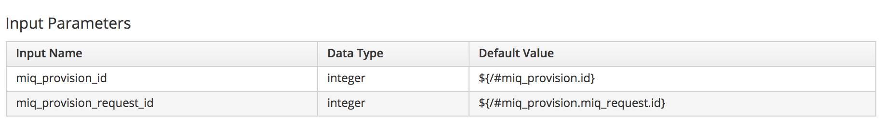

# Calling a Playbook Method from the VM Provision State Machine 

Given the ability to run embedded Ansible playbooks as methods, it can be useful to include such a playbook into an existing workflow such as the VM Provision state machine.
 
In this example an Ansible playbook method is used at the AcquireIPAddress state to insert an IP address, netmask and gateway into the VM provisioning workflow. A cloud-init script is then used at first boot to set the values in the new VM using nmcli.
 
## Creating the Instance and Method
 
A new _acquire\_ip\_address_ instance and method are defined in the usual manner. The method is of **Type:** _playbook_ and is defined to run on **Hosts:** _localhost_


The input parameters for the playbook method are dynamic. Two parameters miq\_provision\_request\_id (the request ID) and miq\_provision\_id (the task ID), are defined as follows:



The new instance is added to the **AcquireIPAddress** state of the VM Provision state machine:


## Inserting the IP Details into the VM Provision Workflow
 
The playbook can write the acquired IP details back into the provision task's options hash in either of two ways: using the RESTful API, or using an Ansible role.
 
### Calling the CloudForms RESTful API
 
The first example playbook uses the CloudForms RESTful API to write the retrieved IP details back in to the provision task's options hash. To simplify the example the IP address, netmask and gateway are defined as static vars; in reality these would be retrieved from a corporate IPAM solution such as Infobox.

```yaml
---
- name: Acquire and Set an IP Address
  hosts: all
  gather_facts: no
  vars:
  - ip_addr: 192.168.1.66
  - netmask: 24
  - gateway: 192.168.1.254
     
  tasks:
  - debug: var=miq_provision_id
  - debug: var=miq_provision_request_id
  
  - name: Update Task with New IP and Hostname Information
    uri:
      url: "{{ manageiq.api_url }}/api/provision_requests/{{ miq_provision_request_id }}/request_tasks/{{ miq_provision_id }}"
      method: POST
      body_format: json
      body:
        action: edit
        resource:
          options:
            addr_mode: ["static", "Static"]
            ip_addr: "{{ ip_addr }}"
            subnet_mask: "{{ netmask }}"
            gateway: "{{ gateway }}"
      validate_certs: no
      headers:
        X-Auth-Token: "{{ manageiq.api_token }}"
      body_format: json
      status_code: 200
```

### Using the _manageiq-vmdb_ Ansible Role

The second example playbook uses the [_manageiq-vmdb_](https://github.com/syncrou/manageiq-vmdb) Ansible role to write the retrieved IP details back into the provision task's options hash. Once again the IP address, netmask and gateway are defined as static vars for simplicity of illustration.

```yaml
---
- name: Acquire and Set an IP Address
  hosts: all
  gather_facts: no
  vars:
  - ip_addr: 192.168.1.66
  - netmask: 24
  - gateway: 192.168.1.254
  - auto_commit: true
  - manageiq_validate_certs: false
      
  roles:
    - syncrou.manageiq-vmdb
     
  tasks:
  - debug: var=miq_provision_id
  - debug: var=miq_provision_request_id
  
  - name: Get the task vmdb object
    manageiq_vmdb:
      href: "provision_requests/{{ miq_provision_request_id }}/request_tasks/{{ miq_provision_id }}"
    register: task_object
    
  - name: Update Task with new IP and Hostname Information
    manageiq_vmdb:
      vmdb: "{{ task_object }}"
      action: edit
      data:
        options:
          addr_mode: ["static", "Static"]
          ip_addr: "{{ ip_addr }}"
          subnet_mask: "{{ netmask }}"
          gateway: "{{ gateway }}"
```
 
In these example playbooks the netmask variable is defined in CIDR format rather than as octets, to be compatible with nmcli.
 
## Configuring the IP Address at First Boot
 
Configuring a NIC with IP address details is a guest operating system operation, and so must be performed when the VM or instance first boots. For this example a template cloud-init script is defined in **Compute -> Infrastructure -> PXE -> Customization Templates** in the WebUI, as follows:

```
<% 
   ip_addr = evm[:ip_addr]
   subnet_mask = evm[:subnet_mask]
   gateway = evm[:gateway]
   dns_servers = evm[:dns_servers]
   dns_suffixes = evm[:dns_suffixes]
%>
#cloud-config
ssh_pwauth: true
disable_root: false
users:
  - default
  - name: ansible-remote
    shell: /bin/bash
    sudo: ['ALL=(ALL) NOPASSWD:ALL']
    ssh_authorized_keys:
      - ssh-rsa AAAAB3NzaC1yc2E...
runcmd:
  - nmcli --fields UUID con show | awk '!/UUID/ {print}' | while read line; do nmcli con delete uuid $line; done 
  - nmcli con add con-name eth0 ifname eth0 type ethernet 
    ip4 "<%= ip_addr %>/<%= subnet_mask %>"
    gw4 "<%= gateway %>"
  - nmcli con mod eth0
    ipv4.dns "<%= dns_servers %>"
    ipv4.dns-search "<%= dns_suffixes %>"
    connection.autoconnect yes
  - nmcli con up eth0
  - systemctl mask cloud-init-local cloud-init cloud-config cloud-final
```

If the cloud-init script is selected from the **Customize** tab of the provisioning dialog, CloudForms will make the variable substitutions at run-time and inject the resultant script into the VM or instance to be run at first boot.
