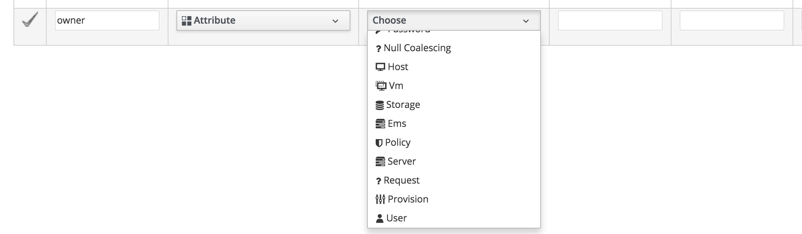
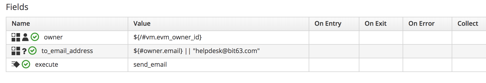

# Miscellaneous Automation Updates

This chapter describes some of the minor miscellaneous updates and changes to Automate in CloudForms 4.5 & 4.6 (ManageIQ *Fine* & *Gaprindashvili*).

## Ruby Automate Enhancements

Several new features have been introduced that are useful for Ruby Automate users.

### Create Service Provision Request

The ability to be able to programmatically schedule a provisioning or automation request using the `$evm.execute('create_provision_request')` and `$evm.execute('create_automation_request')` methods has existed in CloudForms and ManageIQ for several releases.

CloudForms 4.5 (ManageIQ *Fine*) introduced a sibling method `$evm.execute('create_service_provision_request')`, that can be used to schedule the provision of services. It can be used as follows:

``` ruby
service_template = $evm.vmdb('ServiceTemplate').where(:name => 'RHEL 7 VM').first
options = {
  "service_name"              => "Test Service using create_service_provision_request",
  "vm_name"                   => "pemcg-delme-18070601",
  "option_0_cores_per_socket" => 2,
  "option_0_vm_memory"        => 4096,
  "option_0_hostname"         => "pemcg-delme-18070601.lab.eng.bit63.com",
  "option_0_root_password"    => "changeme"
  }
$evm.execute('create_service_provision_request', service_template, options)
```

### Methods Removed from $evm.execute

The following `service_now_*` methods have been removed and are no longer available to run from `$evm.execute`:

```
service_now_eccq_insert(server, username, password, agent, queue, topic, name, source, *params)
service_now_task_get_records(server, username, password, *params)
service_now_task_update(server, username, password, *params)
service_now_task_service(service, server, username, password, *params)
```


### Role-Based Access Control (RBAC)

Ruby Automate methods run in a fully privileged mode by default, and are not subject to the in-built CloudForms or ManageIQ role-based access control. In most cases this is desirable, as automate workflows often need privileged access to objects such as a VMware vCenter external management system, and this is why the **Automation -> Automate** section of the WebUI is restricted to admin-level user roles.

In some cases however admins are required to write Ruby methods that less privileged users will run (for example a dynamic service dialog method), and in this situation it can be advantageous to conditionally enable RBAC so that VMDB searches are always performed in the correct user context. CloudForms 4.5 (ManageIQ *Fine*) introduced three new `$evm` methods to facilitate this:


``` ruby
$evm.rbac_enabled?
$evm.enable_rbac
$evm.disable_rbac
```

The use of these methods can be illustrated with the following Ruby snippet:


``` ruby
$evm.log(:info, "I am user: #{$evm.root['user'].userid}")
$evm.log(:info, "Current value of $evm.rbac_enabled? is: #{$evm.rbac_enabled?}")
$evm.log(:info, "I can see #{$evm.vmdb(:Vm).all.length} VMs")
$evm.log(:info, "Enabling RBAC")
$evm.enable_rbac
$evm.log(:info, "Current value of $evm.rbac_enabled? is: #{$evm.rbac_enabled?}")
$evm.log(:info, "I can see #{$evm.vmdb(:Vm).all.length} VMs")
```

Running this method as a non-privileged user `fredf` in a tenant that has WebUI visibility of 3 VMs, gives the following results:

```
[----] I, [2018-08-...]  INFO -- : <AEMethod test> I am user: fredf
[----] I, [2018-08-...]  INFO -- : <AEMethod test> Current value of $evm.rbac_enabled? is: false
[----] I, [2018-08-...]  INFO -- : <AEMethod test> I can see 18 VMs
[----] I, [2018-08-...]  INFO -- : <AEMethod test> Enabling RBAC
[----] I, [2018-08-...]  INFO -- : <AEMethod test> Current value of $evm.rbac_enabled? is: true
[----] I, [2018-08-...]  INFO -- : <AEMethod test> I can see 3 VMs
```

Repeating the method run as the `admin` user gives a different result, as expected:

```
[----] I, [2018-08-...]  INFO -- : <AEMethod test> I am user: admin
[----] I, [2018-08-...]  INFO -- : <AEMethod test> Current value of $evm.rbac_enabled? is: false
[----] I, [2018-08-...]  INFO -- : <AEMethod test> I can see 18 VMs
[----] I, [2018-08-...]  INFO -- : <AEMethod test> Enabling RBAC
[----] I, [2018-08-...]  INFO -- : <AEMethod test> Current value of $evm.rbac_enabled? is: true
[----] I, [2018-08-...]  INFO -- : <AEMethod test> I can see 18 VMs
```


### State Machine Retry Affinity

In a multi-appliance CloudForms or ManageIQ environment, it can be useful to request that a state machine state retry be executed on the same appliance as the currently running method (by default any appliance with the **Automation Engine** role enabled might de-queue a retry message and execute it). This can now be done using the `ae_retry_server_affinity` attribute, for example:

``` ruby
$evm.root['ae_result'] = 'retry'
$evm.root['ae_retry_interval'] = '30.seconds'
$evm.root['ae_retry_server_affinity'] = true
```

### VM Naming Enhancement

The VM naming functionality during provisioning provides the ability to request that a VM name be created with a zero-padded numeric sequence appended, to guarantee VM name uniqueness. For example setting a request options hash key `:vm_name` of "my\_vm\_$n{3}" prior to the naming process will create a VM named **my_vm\_003** if **my_vm\_001** and **my_vm\_002** have already been provisioned. A challenge has been that the VM naming method is run from request context, and so this flexibility for naming has been unavailable for VMs provisioned from services, where all of the Automate state machines run in task context.

A new enhancement in CloudForms 4.6 (ManageIQ *Gaprindashvili*) has provided an `update_vm_name` method that can be called from task context, for example during the VM Provision state machine as follows:

``` ruby
prov = $evm.root['miq_provision']
vm_name = $evm.root['dialog_vm_name']
prov.update_vm_name("#{vm_name}$n{3}", :update_request => false)
```

The optional second `:update_request` argument determines whether the VM name is also updated in the `description` field of the request's options hash (the default is `true`). 

### Slugs

In an API context a _slug_ is a shortened resource-specific URL part that can be used to uniqiely identify a resource. As an example if the full URI to an API resource is `https://cloudforms02.mycompany.org/api/vms/1000000000892` then the slug portion would be `vms/1000000000892`.

Since CloudForms 4.5 (ManageIQ *Fine*) all objects have had an `href_slug` attribute that can be used to reference the same object via the RESTful API if required, for example:

```
$evm.root['miq_group'].href_slug = groups/1000000000002
```

### Methods with Arguments in Substitution Strings

The automation engine allows substitution strings as instance schema values - for example `${/#miq_provision.placement_auto}` - with the actual value of the variable being substituted at run-time. The substitution syntax does not permit the use of '[' or ']' characters however, and so extracting values from hashes by key reference was difficult.

CloudForms 4.5 (ManageIQ *Fine*) introduced the ability to include methods with arguments in a substitution string, for example:

```
${/#miq_request.get_option(:owner_email)}
${/#service_template_provision_task.destination.stack_options.fetch(:parameters)
```

## New Class Schema Field Data Types

Several new data types have been introduced for class schemas.

### Null Coalescing

The null coalescing data type allows multiple source options to be evaulated in a left-to-right prioritised order. The first non-blank value is used, for example:

`${/#owner.email} || ${/#miq_request.get_option(:owner_email)} || ${/#config.to_email_address}`

### VMDB Objects

CloudForms 4.5 (ManageIQ *Fine*) introduced the ability to have VMDB objects as attribute types (see [New Attribute Field Types](#i1)).



When such an attribute type is used the **Value** field should be an object ID (or a substitution string that resolves to a valid object type ID), and at run-time the corresponding object is loaded into the model. Attributes of that object can then be referenced in other schema field names. 

[New Attributes in Use](#i2) shows a **User** object data type attribute called `owner` supplying its run-time `email` attribute to a **Null Coalescing** data type attribute called `to_email_address`.



## Dynamic Service Models 

Prior to CloudForms 4.6 (ManageIQ *Gaprindashvili*) all service models were statically defined with a corresponding class definition file in _/var/www/miq/vmdb/lib/miq\_automation\_engine/service\_models_. A new feature with this release has allowed service models to be dynamically defined from the active record class if no service model class definition file exists.


## Defining Automate Methods as Classes

CloudForms 4.2 (ManageIQ *Euwe*) introduced a new way of writing Ruby Automate methods, as classes within a nested module structure that (approximately) matches the path to the method in the automation datastore. An example of this can be seen with the _/AutomationManagement/AnsibleTower/Operations/StateMachines/Job/wait\_for\_ip_ method, as follows:

``` ruby
#
# Description: Wait for the IP address to be available on the VM
# For VMWare for this to work the VMWare tools should be installed
# on the newly provisioned vm's

module ManageIQ
  module Automate
    module AutomationManagement
      module AnsibleTower
        module Operations
          module StateMachines
            module Job
              class WaitForIP
                def initialize(handle = $evm)
                  @handle = handle
                end

                def main
                  vm = @handle.root["miq_provision"].try(:destination)
                  vm ||= @handle.root["vm"]
                  vm ? check_ip_addr_available(vm) : vm_not_found
                end

                def check_ip_addr_available(vm)
                  ip_list = vm.ipaddresses
                  @handle.log(:info, "Current Power State #{vm.power_state}")
                  @handle.log(:info, "IP addresses for VM #{ip_list}")

                  if ip_list.empty?
                    vm.refresh
                    @handle.root['ae_result'] = 'retry'
                    @handle.root['ae_retry_interval'] = 1.minute
                  else
                    @handle.root['ae_result'] = 'ok'
                  end
                end

                def vm_not_found
                  @handle.root['ae_result'] = 'error'
                  @handle.log(:error, "VM not found")
                end
              end
            end
          end
        end
      end
    end
  end
end
if __FILE__ == $PROGRAM_NAME
  ManageIQ::Automate::AutomationManagement::AnsibleTower::Operations::StateMachines::Job::WaitForIP.new.main
end
```

The subsequent two versions of the product have expanded the use of this coding style, and its use is now encouraged for user-written Automate methods.

The main advantage of this style of writing methods as classes is that it enables the use of _spec_ files for unit testing. The corresponding spec file to test the above method is as follows:


``` ruby
require_domain_file

describe ManageIQ::Automate::AutomationManagement::AnsibleTower::Operations::StateMachines::Job::WaitForIP do
  let(:user) { FactoryGirl.create(:user_with_group) }
  let(:vm) { FactoryGirl.create(:vm) }
  let(:klass) { MiqAeMethodService::MiqAeServiceVm }
  let(:svc_vm) { klass.find(vm.id) }
  let(:ip_addr) { ['1.1.1.1'] }
  let(:svc_job) { job_class.find(job.id) }
  let(:root_object) { Spec::Support::MiqAeMockObject.new }
  let(:service) { Spec::Support::MiqAeMockService.new(root_object) }

  it "#main - ok" do
    root_object['vm'] = svc_vm
    allow_any_instance_of(klass).to receive(:ipaddresses).with(no_args).and_return(ip_addr)
    allow_any_instance_of(klass).to receive(:refresh).with(no_args).and_return(nil)

    described_class.new(service).main

    expect(root_object['ae_result']).to eq('ok')
  end

  it "#main - retry" do
    root_object['vm'] = svc_vm
    allow_any_instance_of(klass).to receive(:ipaddresses).with(no_args).and_return([])
    allow_any_instance_of(klass).to receive(:refresh).with(no_args).and_return(nil)

    described_class.new(service).main

    expect(root_object['ae_result']).to eq('retry')
  end
end
```

## Summary

This chapter has introduced some of the more minor new features and changes that have occurred since the [Mastering Automation in CloudForms 4.2 and ManageIQ Euwe](https://pemcg.gitbooks.io/mastering-automation-in-cloudforms-4-2-and-manage/content/) book was published. The remaining sections and chapters in this addendum will discuss the most significant new features.

## Further Reading

[Convert Automate Methods to New Style Using Classes](https://github.com/ManageIQ/manageiq-content/issues/8)

[VM Naming Change](http://talk.manageiq.org/t/vm-naming-change/3195)

[Dynamic Service Models](https://github.com/ManageIQ/manageiq/pull/14465)

[An Introduction into the Process of Unit Testing CloudForms Automation Methods](https://github.com/jeffwarnica/manageiq-content-sample-tests/blob/master/UnitTestingCloudFormsAutomate.md)