# New Service Dialog Editor

CloudForms 4.6 (ManageIQ *Gaprindashvili*) has introduced a new drag-and-drop service dialog editor.

The dialog editor is invoked through the **Automation -> Automate -> Customization** menu, and from the **Configuration** button (see screenshot [Adding a New Dialog](#i1)).

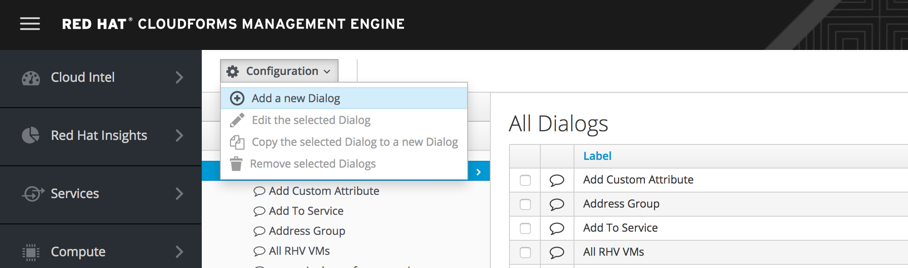

## Creating a New Dialog

The empty dialog editor displays the list of possible element types as a vertical column along the left-hand side of the editor (see screenshot [Empty Dialog Editor](#i2)).

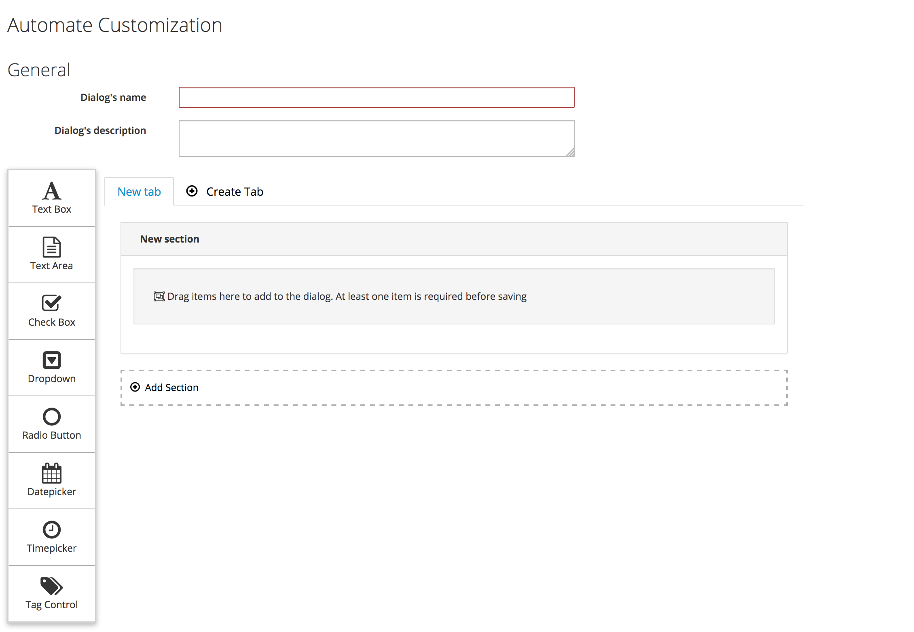

The empty dialog "canvas" can be designed as required. New tabs or sections can be created by clicking the **Create Tab** or **Add Section** links. 

### Adding Elements

Elements are added to the dialog by dragging from the sidebar and dropping onto the appropriate section (see screenshot [Dragging a Text Box onto the Dialog](#i3)).

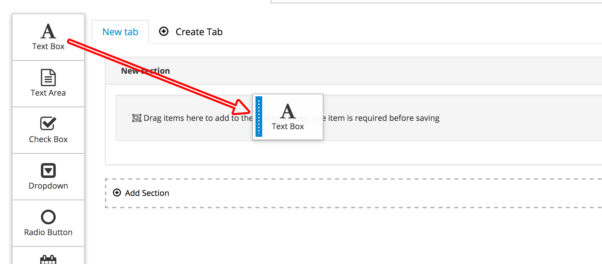

Multiple elements can be reorganised within a section by dragging and releasing (elements cannot be dragged between sections).

### Editing Elements

Element details can be edited by clicking on the pen icon on the right of the element (see screenshot [Editing an Element](#i4)).

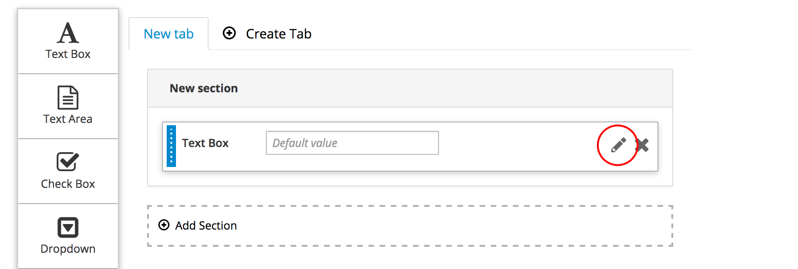

#### Field Information Tab

The **Field Information** tab contains entry fields for general information, and a slider to determine whether or not the element is to be populated dynamically (see screenshot [Field Information Tab](#i5)).

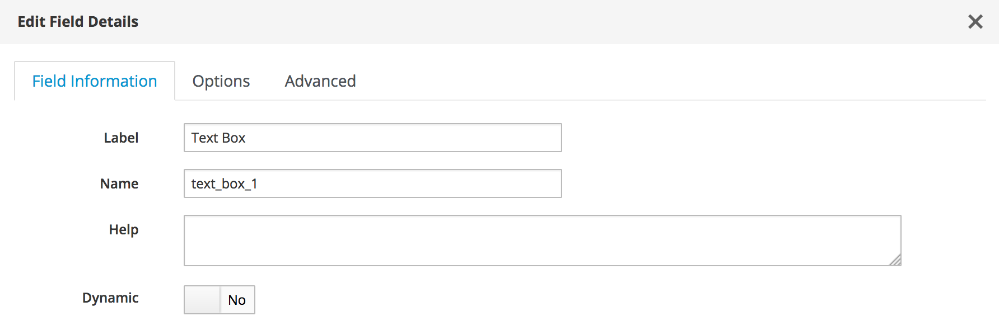

#### Options Tab

The **Options** tab contains entry fields, sliders and drop-down selections that define the element characteristics (see screenshot [Options Tab for a Static Element](#i6)).

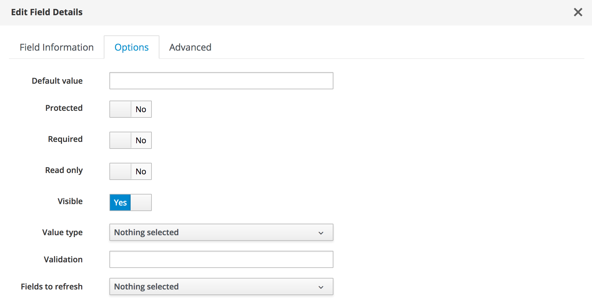

#### Advanced Tab

The **Advanced** tab allows an element to be defined as **Reconfigurable** if required (see screenshot [Advanced Tab](#i7)).

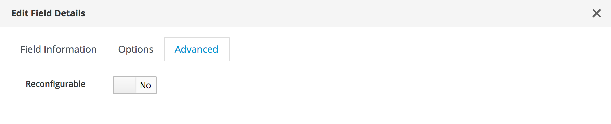

### Dynamic Element Fields

If the **Dynamic** slider in the **Field Information** tab is switched to **Yes**, the available options in the **Options** tab change and some are moved to a new **Overridable Options** tab (see screenshots [Options Tab for a Dynamic Element](#i8) and [Overridable Options Tab](#i9)).

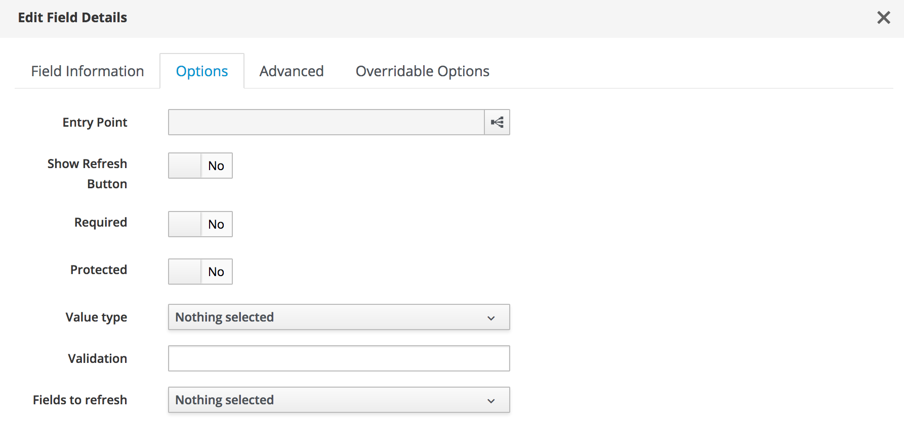

#### Overridable Options Tab

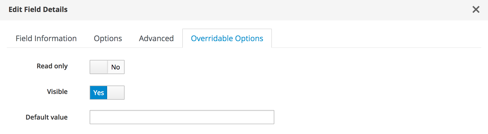

Element options on the **Overridable Options** tab can be overridden programmatically from the dynamic method, if required.

#### Entry Point Field

The **Entry Point** field on the **Options** tab presents an Automate Datastore browser that can be used to select the dynamic method to populate the element values at run-time (see screenshot [Selection of Method to Populate Dynamic Element](#i10)).

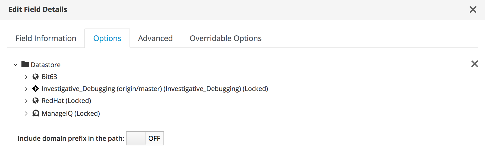

### Optional Help

The **Field Information** tab contains a **Help** box that can be used to populate an informational message when the dialog is run (see screenshot [Setting Help Text](#i11)).

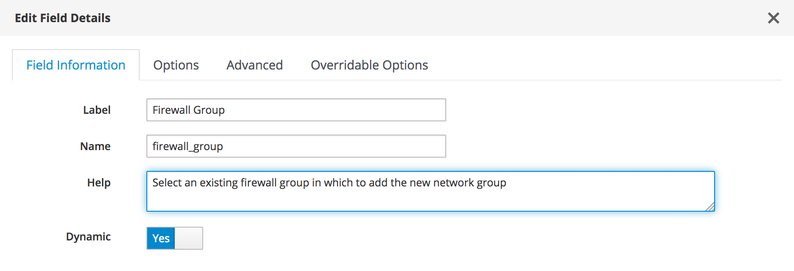

When the dialog is run the help text is available from the _i_ icon (see screenshot [Displaying Help Text](#i12)).

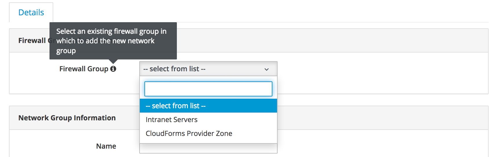

### Fields to Refresh {#fields_to_refresh}

Prior to CloudForms 4.6 (ManageIQ *Gaprindashvili*) dynamic service dialog elements could be set to refresh automatically with the **Auto refresh** option. A corresponding option **Auto Refresh other fields when modified** could be defined on other elements that would trigger _all_ **Auto refresh** elements in the dialog to update.

The new service dialog functionality has extended this auto-refresh capability to make it much more granular. The **Options** tab for an element now has a **Fields to Refresh** drop-down that allows individually selected dynamic elements to be refreshed (see screenshot [Setting Fields to Refresh](#i13)).

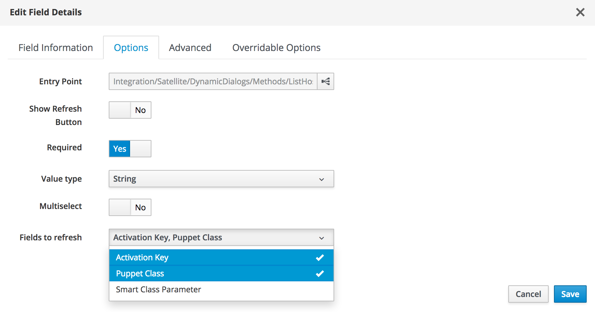

> **Warning**
> 
> Care should be taken that circular references are avoided and that elements are not set to mutually refresh each other.

### Multi-Select Elements

A Dropdown element has an **Options** tab option of **Multiselect** (see screenshot [Defining a Multiselect Element](#i14)).

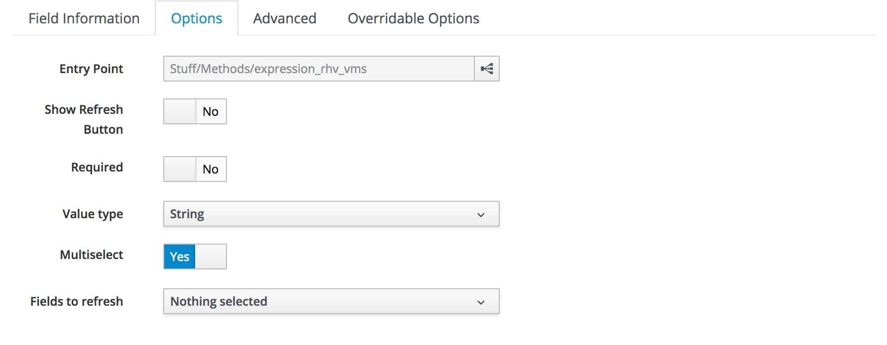

When the dialog is run the user has the option of selecting multiple values from the dropdown list (see screenshot [Selecting Multiple Values from a Dropdown List](#i14)).

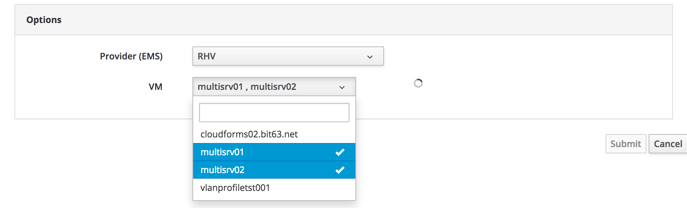

### Element Visibility

Elements can be optionally marked as hidden using the **Visible** slider from the **Options** tab for a static element, or the **Overridable Options** tab for a dynamic element. Hidden elements are not visible when the dialog is initially loaded, however dynamic element methods can toggle the visibility status for an element to unhide them, perhaps based on the input from a previous element.

The following dynamic method sets an element to be conditionaly visible depending on the input from a previous radio button:

``` ruby
service_name_required = $evm.root['dialog_service_name_required']
list_values = {
  'required'   => false,
  'protected'  => false,
}
case service_name_required
when 't'
   list_values['visible'] = true
else
   list_values['visible'] = false
end
list_values.each do |key, value|
  $evm.object[key] = value
end
```

### Summary

This chapter has discussed the new service dialog functionality with CloudForms 4.6 (ManageIQ *Gaprindashvili*). Dialogs can be created more easily, and to be more dynamic than ever before.
