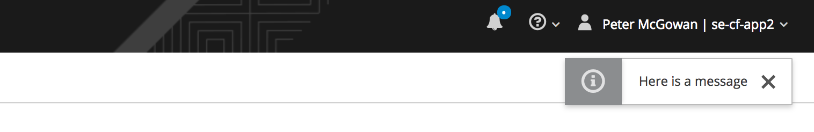

# Notification Messages

CloudForms 4.2 introduced the ability for users to see pop-up notifications in the WebUI, and this capability has been expanded considerably with CloudForms 4.5 & 4.6 (ManageIQ *Fine* & *Gaprindashvili*). In this chapter we'll look at how these notication pop-ups can be sent to users from a Ruby Automate method. 

> **Note**
> 
> The notifications feature requires the **Websocket** server role to be enabled on all WebUI appliances.

## Sending Notifications from Automate

Notification messages can be sent using `$evm.create_notification`, specifying one or more arguments, for example:
 
``` ruby
$evm.create_notification(:audience => 'user', :message => "Here is a message")
```

This will result in a notification pop-up appearing in the top right-hand corner of the WebUI (see [Pop-Up Notification](#i1)).



The call to `$evm.create_notification` can take several arguments.
 
### Audience
 
The `:audience` argument determines which users can see the message. It is optional; if no `:audience` is specified then the default is 'user'. The options can be 'tenant', 'group', 'user', 'global' or 'superadmin', and this is relative to the user context that the automation method is running in (i.e `$evm.root['user']`). 

As an example, `:audience => 'tenant'` will be sent to all users in the same tenant as the user running the current automation method.

> **Note**
> 
> The argumemnt `:audience => 'group'` is intended specifically for use with the message type arguments `:type => :request_approved` or `:type => :request_denied`. Although `:audience => 'group'` can be used for user-generated messages, if it is used then the `$evm.create_notification` call must also contain a `:subject` argument whose value is a request-like object (it must return a valid user object when queried with `requester`).

 
### Level
 
There is an optional `:level` argument that can be specified when sending a message, and this can be one of 'success', 'info', 'warning' and 'error'. This determines the colour and icon type of the notification pop-up. If `:level` is not specified then the default is 'info'.
 
### Message
 
There is an optional `:message` argument that can specify the message to be sent if one of the pre-defined message types is not used.
 
### Subject

The `:subject` argument is required by some message types, and should refer to the object about which the message pertains, for example:

``` ruby
$evm.create_notification(:type => :automate_vm_provisioned, :subject => $evm.root['vm'])
```

### Type
 
In CloudForms 4.6 there are 54 pre-defined message types that can be used, although most of the message types have been created to be used internally within automate.
 
Each message type uses one or more additional arguments, for example `:subject`, and most of these arguments require an object rather than a text string (`:message` is an exception to this). The pre-defined message types are held in the `notification_types` table in the database, as follows:

``` sql
vmdb_production=# select name,level,audience,message from notification_types;
                 name                 |  level  |  audience  | message
--------------------------------------+---------+------------+----------------------------------------------------------------------------------------------------------------------------------------------
 host_provisioned                     | success | tenant     | Host %{subject} has been provisioned.
 automate_service_provisioned         | success | tenant     | Service %{subject} has been provisioned.
 service_retired                      | success | tenant     | Service %{subject} has been retired.
 service_retiring                     | success | tenant     | Service %{subject} has started retirement.
 automate_vm_provisioned              | success | tenant     | Virtual Machine %{subject} has been provisioned.
 vm_retired                           | success | tenant     | Virtual Machine %{subject} has been retired.
 vm_retiring                          | success | tenant     | Virtual Machine %{subject} has started retirement.
 request_approved                     | success | group      | Request %{subject} has been approved.
 request_denied                       | warning | group      | Request %{subject} has been denied.
 automate_user_success                | success | user       | %{message}
 automate_user_error                  | error   | user       | %{message}
 automate_user_info                   | info    | user       | %{message}
 automate_user_warning                | warning | user       | %{message}
 automate_tenant_success              | success | tenant     | %{message}
 automate_tenant_error                | error   | tenant     | %{message}
 automate_tenant_info                 | info    | tenant     | %{message}
 automate_tenant_warning              | warning | tenant     | %{message}
 automate_global_success              | success | global     | %{message}
 automate_global_error                | error   | global     | %{message}
 automate_global_info                 | info    | global     | %{message}
 automate_global_warning              | warning | global     | %{message}
 evm_server_memory_exceeded           | error   | superadmin | The server %{name} memory usage %{memory_usage} exceeded limit %{memory_threshold}.  The server process %{pid} exited and will be restarted.
 mw_op_success                        | success | global     | The operation %{op_name} %{op_arg} on %{mw_server} completed successfully.
 mw_op_failure                        | warning | global     | The operation %{op_name} %{op_arg} on %{mw_server} has failed to complete. Please check the logs for further details.
 role_activate_success                | info    | superadmin | The role %{role_name} has been activated on server %{server_name}
 role_activate_start                  | info    | superadmin | The role %{role_name} has started activation on server %{server_name}
 vm_cloud_live_migrate_success        | success | global     | Live migrating Instance %{instance_name} completed successfully.
 vm_cloud_live_migrate_error          | error   | global     | Live migrating Instance %{instance_name} failed: %{error_message}
 vm_cloud_evacuate_success            | success | global     | Evacuating Instance %{instance_name} completed successfully.
 vm_cloud_evacuate_error              | error   | global     | Evacuating Instance %{instance_name} failed: %{error_message}
 tower_op_success                     | success | global     | The operation %{op_name} %{op_arg} on %{tower} completed successfully.
 tower_op_failure                     | error   | global     | The operation %{op_name} %{op_arg} on %{tower} has failed to complete. Please check the logs for further details.
 vm_snapshot_success                  | warning | global     | The operation %{snapshot_op} on snapshot of %{subject} completed successfully.
 vm_snapshot_failure                  | warning | global     | Failed to %{snapshot_op} snapshot of %{subject}: %{error}
 orchestration_stack_retired          | success | tenant     | Orchestration Stack %{subject} has been retired.
 provider_operation_success           | success | global     | The operation %{method} on %{target_name} completed successfully.
 provider_operation_failure           | error   | global     | The operation %{method} on %{target_name} failed: %{error}
 vm_destroy_success                   | success | global     | Destroying Virtual Machine %{subject} completed successfully.
 vm_destroy_error                     | error   | global     | Destroying Virtual Machine %{subject} failed: %{error_message}
 cloud_volume_attach_success          | success | global     | Attaching Volume %{subject} to Instance %{instance_name} completed successfully.
 cloud_volume_attach_error            | error   | global     | Attaching Volume %{subject} to Instance %{instance_name} failed: %{error_message}
 cloud_volume_detach_success          | success | global     | Detaching Volume %{subject} from Instance %{instance_name} completed successfully.
 cloud_volume_detach_error            | error   | global     | Detaching Volume %{subject} from Instance %{instance_name} failed: %{error_message}
 cloud_volume_create_success          | success | global     | Creating Volume %{volume_name} completed successfully.
 cloud_volume_create_error            | error   | global     | Creating Volume %{volume_name} failed: %{error_message}
 cloud_volume_update_success          | success | global     | Updating Volume %{subject} completed successfully.
 cloud_volume_update_error            | error   | global     | Updating Volume %{subject} failed: %{error_message}
 cloud_volume_delete_success          | success | global     | Deleting Volume %{subject} completed successfully.
 cloud_volume_delete_error            | error   | global     | Deleting Volume %{subject} failed: %{error_message}
 cloud_volume_snapshot_create_success | success | global     | Creating Snapshot %{snapshot_name} of Volume %{volume_name} completed successfully.
 cloud_volume_snapshot_create_error   | error   | global     | Creating Snapshot %{snapshot_name} of Volume %{volume_name} failed: %{error_message}
 cloud_volume_snapshot_delete_success | success | global     | Deleting Snapshot %{subject} of Volume %{volume_name} completed successfully.
 cloud_volume_snapshot_delete_error   | error   | global     | Deleting Snapshot %{subject} of Volume %{volume_name} failed: %{error_message}
 server_registration_error            | error   | superadmin | Registration failed for server %{server_name}
(54 rows)
```

The `:type` argument can be used as follows:

``` ruby
$evm.create_notification(:type => :automate_tenant_success, :message => 'test')
```
## The Bang Form

There is a bang form of the method - `$evm.create_notification!` - that raises an error if it fails to display the notification (the normal `$evm.create_notification` form just returns `nil` on failure).

## Summary

This chapter has introduced the notifications feature of CloudForms and ManageIQ, and how it can be used from Automate. Notification pop-ups are very useful, and can be used to notify users at various stages of a workflow, particularly of abnormal conditions such as workflow errors. 

