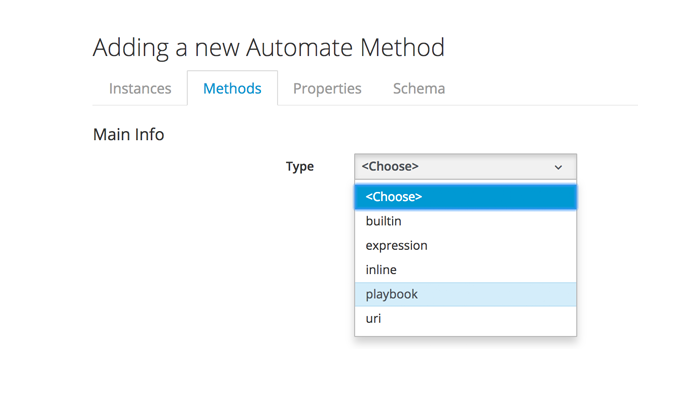

# Ansible Playbook Methods

CloudForms 4.6 / ManageIQ *Gaprindashvili* has introduced the capability to run Ansible playbooks as automation methods. It is now possible to mix Ruby and/or Ansible methods in a single state machine or instance.

## Creating a Playbook Method

A playbook method is created in the same way as other automate methods. CloudForms 4.6 (ManageIQ *Gaprindashvili*) has added two more method types, one of which is *playbook* (see [Adding a New Playbook Method](#i1))



Once the method **Type** of **playbook** has been selected the method definition page appears, which contains the same input options as the **Provisioning** tab when creating a playbook service (see ...)

### Max TTL (mins)

For a playbook method a value for **Max TTL (mins)** should always be entered. In CFME 5.9.3 the default is 0 minutes.

If the **Max TTL (mins)** value is too low the _ManageIQ::Providers::EmbeddedAnsible::AutomationManager::PlaybookRunner_ class will terminate the playbook job with an error such as:

```
Automation Error: job timed out after 96.890827024 seconds of inactivity. Inactivity threshold [60 seconds]
```
> **Note**
> 
> If **Update on Launch** was checked in the repository definition, the time taken to refresh the repository is included in the Max TTL duration.

## Host Values

The **Hosts** input dialog has two options: **Localhost** or **Specify host values**. In many cases we would wish to run the playbook on the CFME or ManageIQ appliance itself, so **Localhost** should be selected. In other cases we might wish to run a playbook on a managed node as part of a workflow - such as a VM provision - in which case the hostname or IP address might not be known at the time that the playbook method is created. Fortunately we can use the automation engine's substitution syntax in the **Hosts** dialog. This allows us to specify an attribute that at run-time would contain the valid value for a managed node's IPv4 address or fully-qualified domain name, for example `${/#miq_provision.destination.ipaddresses.first}` for an infrastructure VM provision, or `${/#miq_provision.destination.floating_ip_addresses.first}` for a cloud instance provision.


> **Note**
> 
> The automation engine's substitution syntax is `${object#attribute_name}` where `object` can be "/" for the root object, or "" (or ".") for the current object. 
> 
> For example a substitution string of `${/#dialog_vm_name}` would take the value of `$evm.root['dialog_vm_name']` at run-time. A substitution string of `${#username}` would take the value of `$evm.object['username']` at run-time.

## Input Parameters

The **Input Parameters** section of the playbook method creation page allows us to add variables that will be made available to the playbook at run-time. This corresponds to the **Variables & Default Values** section when creating a playbook service, but unlike when creating a playbook service, the **Input Parameters** can take the form of automation engine substitution strings.


## Variables Available to the Ansible Playbook

When an Ansible playbook is run as an automate method, a number of manageiq-specific variables are made available to the playbook to use in addition to the input parameters. These are similar to the variables available to a playbook service, but with the addition of the **automate\_workspace** variable that allows the playbook to interact with the `$evm` workspace managing the automation workflow.

``` yaml
"manageiq": {
    "X_MIQ_Group": "EvmGroup-super_administrator",
    "api_token": "4b90eb34f6374f5d61c16c969b53f018",
    "api_url": "https://10.2.3.4",
    "automate_workspace": "automate_workspaces/cf7df7bd-b871-46e3-a634-a3c30d644e5c",
    "group": "groups/2",
    "user": "users/1"
},
"manageiq_connection": {
    "X_MIQ_Group": "EvmGroup-super_administrator",
    "token": "4b90eb34f6374f5d61c16c969b53f018",
    "url": "https://10.2.3.4"
}
```

## Workspace

The ability to be able to interact with the automate workspace - much like a Ruby automate method - increases the versatility of Ansible playbook methods and allows Ruby and Ansible methods to be interspersed in the same state machines or workflows.

A typical json content of the automate workspace as retrieved in the playbook is as follows:

``` yaml
"json": {
    "actions": [
        {
            "href": "https://10.2.3.4/api/automate_workspaces/7bd6c913-7366-...",
            "method": "post",
            "name": "edit"
        },
        {
            "href": "https://10.2.3.4/api/automate_workspaces/7bd6c913-7366-...",
            "method": "post",
            "name": "encrypt"
        },
        {
            "href": "https://10.2.3.4/api/automate_workspaces/7bd6c913-7366-...",
            "method": "post",
            "name": "decrypt"
        }
    ],
    "guid": "7bd6c913-7366-4d10-acf4-61af57465c75",
    "href": "https://10.2.3.4/api/automate_workspaces/7bd6c913-7366-...",
    "id": "63",
    "input": {
        "current": {
            "class": "twostate",
            "instance": "test",
            "message": "create",
            "method": "workspace_test",
            "namespace": "Bit63/statemachines"
        },
        "method_parameters": {},
        "objects": {
            "/Bit63/statemachines/twostate/test": {
                "::miq::parent": "/ManageIQ/System/Request/call_instance"
            },
            "/ManageIQ/System/Request/call_instance": {
                "::miq::parent": "root"
            },
            "root": {
                "ae_next_state": "",
                "ae_provider_category": "unknown",
                "ae_result": "ok",
                "ae_retry_server_affinity": false,
                "ae_state": "execute2",
                "ae_state_max_retries": 0,
                "ae_state_retries": 0,
                "ae_state_started": "2018-04-24 10:49:37 UTC",
                "ae_state_step": "main",
                "class": "twostate",
                "instance": "test",
                "message": "create",
                "miq_group": "href_slug::groups/2",
                "miq_server": "href_slug::servers/1",
                "miq_server_id": "1",
                "namespace": "statemachines",
                "object_name": "Request",
                "request": "call_instance",
                "tenant": "href_slug::tenants/1",
                "user": "href_slug::users/1",
                "user_id": "1"
            }
        },
        "state_vars": {
            "date_stamp": "2018-04-24 11:49:37 +0100"
        }
    },
    "tenant_id": "1",
    "user_id": "1"
}
```

As can be seen, all of the workspace variables that are typically accessed fom a Ruby method - for example `$evm.root` attributes such as `ae_state_retries`- are also available from an Ansible playbook method.

### Passing Values via the Workspace

As with 'traditional' Ruby-based automation, values can be saved to and retored from the `$evm` workspace, and used in subsequent stages of a workflow. 

#### Instance Attributes

For a simple instance schema containing one or more Ansible playbook methods interspersed with one or more Ruby methods, values can be passed as `$evm.root` or `$evm.object` attributes. This can be illustrated with a simple playbook that stores the `tower_job_id` value in the workspace using the `manageiq-automate` role, as follows:

``` yaml
---
- name: Save tower job id back to $evm.root
  hosts: all
  connection: local

  vars:
  - manageiq_validate_certs: false
      
  roles:
  - syncrou.manageiq-automate

  tasks:
  - name: "Save the job ID back into $evm.root"
    manageiq_automate:
      workspace: "{{ workspace }}"
      set_attribute:
        object: "root"
        attribute: "tower_job_id"
        value:  "{{ tower_job_id }}"
```

The saved `tower_job_id` value can be read from `$evm.root` by a Ruby method, and used to lookup the output of the Ansible playbook, as follows:


``` ruby
JOB_CLASS = 'ManageIQ_Providers_EmbeddedAnsible_AutomationManager_Job'.freeze
tower_job_id = $evm.root['tower_job_id'].to_s
if tower_job_id.blank?
  raise "No Tower Job ID returned, cannot get output"
else
  job = $evm.vmdb(JOB_CLASS).where(["ems_ref = ?", tower_job_id]).first
  $evm.log(:info, "Output from previous Ansible playbook: \n#{job.stdout}")
end
```


#### State Variables

Attribute values in `$evm.root` or `$evm.object` in a state machine are not saved if any state triggers a retry. State variables can however be used to store values between state machine retries, and these can be written and read from both Ansible playbook and Ruby methods.

This can be illustrated with the following two state machine methods. The first (Ruby) method writes a simple state variable containing the current time, as follows:

``` Ruby
$evm.set_state_var(:date_stamp, "#{Time.now}")
```

The second (Ansible playbook) method retrieves the saved state variable using the `manageiq-automate` role, as follows: 

``` yaml
---
- name: Example of Workspace interaction - reading a state_var
  hosts: localhost
  connection: local

  vars:
  - manageiq_validate_certs: false
  - auto_commit: true

  roles:
  - syncrou.manageiq-automate

  tasks:
  - name: Retrieve the saved 'date_stamp' state var
    manageiq_automate:
      workspace: "{{ workspace }}"
      get_state_var:
        attribute: "date_stamp"
    register: saved_date_stamp

  - debug: var=saved_date_stamp
```

In this example the playbook method simply prints the output using a `debug` task. The debug output line is as follows:

```
TASK [debug] *******************************************************************
ok: [localhost] => {
    "saved_date_stamp": {
        "changed": false,
        "failed": false,
        "value": "2018-07-19 11:20:24 +0100"
    }
}
```

## State Machine Retries

If an Ansible playbook method is used in a state machine, the state running the playbook will be put into an automatic retry condition, without the `on_exit` method being run.

A playbook can also trigger its own state retry.
