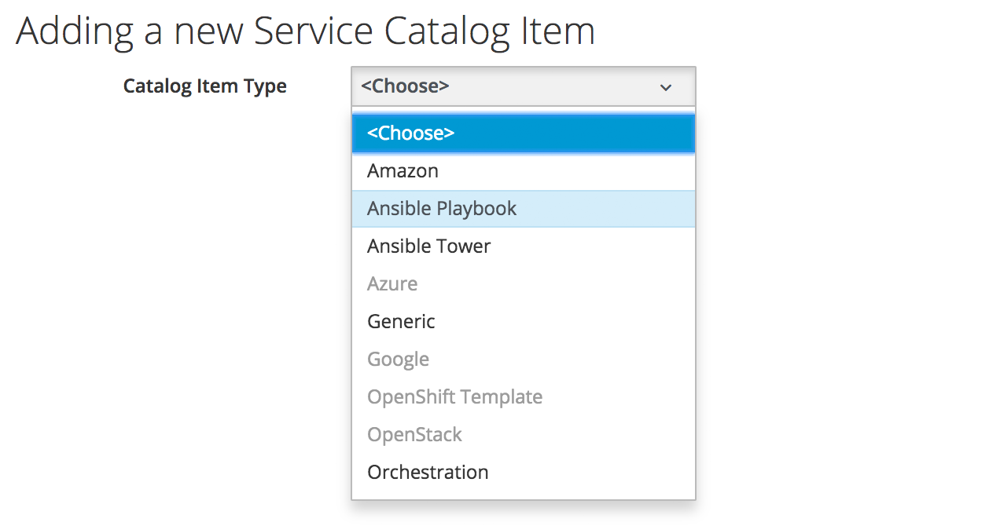
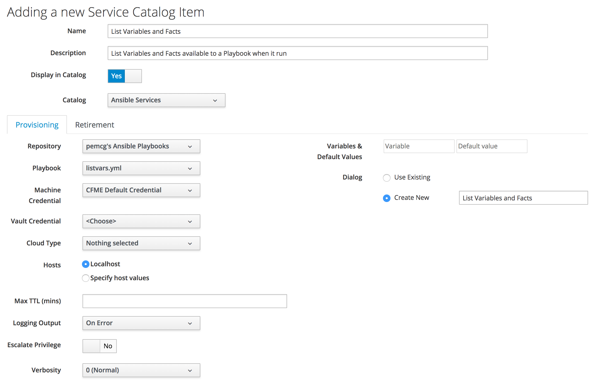
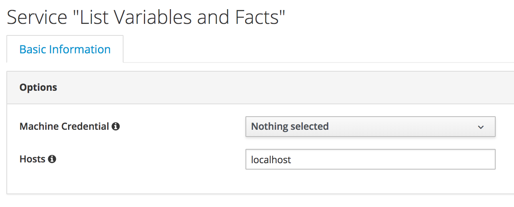

# Ansible Playbook Services

CloudForms 4.5 / ManageIQ *Fine* introduced the capability to run Ansible playbooks as services. Playbook services can be ordered interactively through the service catalog, from Automate, or can be used as control actions or alerts.

In this chapter we'll create a simple playbook service that runs the following playbook to list the variables and facts available to an embedded Ansible playbook as it runs:

``` yaml
---
- name: List Variables
  hosts: all

  roles:
     - ansible-role-listvars
```

## Creating a Playbook Service

A new service catalog item type, **Ansible Playbook** is used to create a playbook service:



Once 'Ansible Playbook' is selected, the main service creation dialog is displayed:



## Provisioning Tab Options

The selectable options on the **Provisioning** tab are as follows:

* **Repository/Playbook** - the repository to select from, and the playbook to run when the service it ordered.
* **Machine Credential** - the credential to use to run the playbook. For playbooks run on _localhost_ the **CFME Default Credential** can be used. This value can be overriden from a service dialog when the service is ordered.
* **Vault Credential** - the credential to unlock a vault file, if used.
* **Cloud Type/Cloud Credential** - the cloud type and credential to use if the playbook is to connect to a cloud provider.
* **Hosts** - the host(s) on which the playbook should be run (comma-separated list). This value can be overriden from a service dialog when the service is ordered.
* **Max TTL (mins)** - the maximum time that the playbook should be allowed to run (default: 10 minutes) 
* **Logging Output** - whether to log playbook output to evm.log (On Error / Always / Never)
* **Escalate Privilege** - option to run the playbook using the privilege escalation mode and credentials defined in the selected **Machine Credential**.
* **Verbosity** - the desired verbosity (from 0 to 5) of the playbook output
* **Variables & Default Values** - optional variables and values to pass into the playbook. The values can be overriden from a service dialog when the service is ordered.
* **Dialog** - the selection of service dialog to use when the service is ordered; either an existing dialog, or an option to create a new one using the entered **Variables & Default Values**

> **Note**
> 
> Although the service can be created and saved with neither **Dialog** radio button selected, ordering the resultant service catalog item will fail with the error **No Ordering Dialog is available**
> 

## Retirement Tab Options

An optional retirement playbook can be specified from the **Retirement** tab. This tab contains the same options as the **Provisioning** tab, but with the addition of a **Remove Resources?** drop-down selection. This can take the following options:

* No - leave the resources in place, just run the retirement playbook.
* Before Playbook runs - remove the resources and then run the retirement playbook.
* After Playbook runs - run the retirement playbook and then remove the resources.

> **Note**
> 
> In this context **Resources** are VMs associated with the service

Creating a retirement playbook is not neccessarily straightforward. The idempotent nature of Ansible means that the steps to 'undo' the tasks run by a provisioning playbook may not be predictable. This can be illustrated with a provisioning playbook containing the following task:

``` yaml
  tasks:
  - name: Install package
    yum: name={{ package }} state=present
```

The package may not have been installed by the provisioning playbook if it already existed on the managed node. The following retirement playbook would therefore leave the managed node in an incorrect state:

``` yaml
  tasks:
  - name: Remove package
    yum: name={{ package }} state=absent
```
## Ordering the Service

When we order the service we are presented with the service dialog that was created automatically. It gives us a choice of overriding the machine credential and host that were selected when the catalog item was created. If we leave these as default the playbook will run on _localhost_



The resultant service (in **My Services**) has a **Provisioning** tab that shows the results of the playbook run.


We can order the service again, but this time override the service dialog defaults to run the playbook on another host, using SSH Key credentials suitable for that host. The service dialog is as follows:


This time we can see from the resultant service **Provisioning** tab that the playbook has been run on the remote host:


## Variables Available to the Ansible Playbook

When an Ansible playbook is run as a service, several manageiq-prefixed variables are made available to the playbook to use, for example:

``` yaml
"manageiq": {
    "X_MIQ_Group": "EvmGroup-super_administrator",
    "action": "Provision",
    "api_token": "ef956ff763ccf6c1ca77199eff6e25f2",
    "api_url": "https://10.2.3.4",
    "group": "groups/2",
    "service": "services/27",
    "user": "users/1"
},
"manageiq_connection": {
    "X_MIQ_Group": "EvmGroup-super_administrator",
    "token": "ef956ff763ccf6c1ca77199eff6e25f2",
    "url": "https://10.2.3.4"
}
```

These enable us to connect back to the RESTful API from the playbook without hard-coding appliance IP addresses or credentials. Of particular use is the `manageiq.service` variable which contains the href_slug of the currently running service. This enables the playbook to manipulate the service while it's running, for example to add newly provisioned VMs, or (as in the following example) rename the service.

``` yaml
  tasks:
  - set_fact:
      timestamp: "{{ lookup('pipe', 'date +%Y-%m-%d\\ %H:%M') }}"
      
  - name: Get the existing service name
    uri:
      url: "{{ manageiq.api_url }}/api/{{ manageiq.service }}"
      method: GET
      validate_certs: no
      headers:
        X-Auth-Token: "{{ manageiq.api_token }}"
      body_format: json
    register: current_service
 
  - name: Update the service name with appended timestamp
    uri:
      url: "{{ manageiq.api_url }}/api/{{ manageiq.service }}"
      method: POST
      validate_certs: no
      headers:
        X-Auth-Token: "{{ manageiq.api_token }}"
      body_format: json
      body:
        action: edit
        resource:
          name: "{{ current_service.json.name }} {{ timestamp }}"
```

> **Note**
> 
> In a multi-appliance CloudForms or ManageIQ region the **Configuration -> Advanced** `session_store` setting should be set to "sql" when using the `manageiq.api_token` variable (see [Ansible Automation Inside playbooks are not able to use the manageiq.api\_token extra\_var for authentication with the CloudForms API in a multi appliance region](https://access.redhat.com/solutions/3317761))


