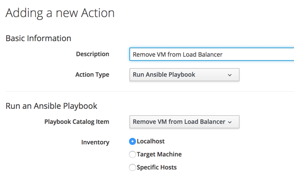

# Non-Interactively Running a Playbook Service 

Although the traditional way of ordering a service is interactively via **Services -> Catalogs** in the WebUI, there are also two ways that embedded Ansible services can be launched with no user interaction. When run in this way the default values from the service's dialog are used.
    
## Playbook Services as Control Actions

An embedded Ansible playbook service can be run as a control action. In this example we'll define a control action that requests a playbook service to remove a web service VM from a load balancer pool. The playbook will run on localhost (the CFME appliance).

The action in created in the usual manner from the **Control -> Actions -> All Actions -> Configuration** (button)  **-> Add a new Action** menu option. A new **Action Type** of **Run Ansible Playbook** is available, which when selected allows a playbook service to be chosen from the **Playbook Catalog Item** drop-down list. (see [Adding the Control Action](#i1)).



The newly created action can be linked to a control policy, triggered by a **VM Power Off** event, and a condition that the VM is tagged as a Web Service VM (see [Creating the Control Policy](#i2)).


> **Note**
> 
> Running an embedded Ansible playbook service in this way still goes through the service approval process.


### Variables Available to the Ansible Playbook

Several variables are available to an Ansible playbook running from a control action, as follows:

``` yaml
        "manageiq": {
            "X_MIQ_Group": "EvmGroup-super_administrator",
            "action": "Provision",
            "api_token": "befb11cc0dd25d8650b7beec1537525b",
            "api_url": "https://10.2.3.4",
            "event_name": "vm_poweroff",
            "event_target": "vms/1000000001277",
            "group": "groups/1000000000002",
            "service": "services/1000000000037",
            "user": "users/1000000000005"
        },
        "manageiq_connection": {
            "X_MIQ_Group": "EvmGroup-super_administrator",
            "token": "befb11cc0dd25d8650b7beec1537525b",
            "url": "https://10.2.3.4"
        },
```

Of particular use in a control action context are the `event_name` and `event_target` variables which convey the type of event that was raised, and the object href_slug that triggered the event.  

### Deleting the Service Once the Playbook has Run

Each time a playbook control action runs a new service will be created under **My Services** in the WebUI. Although this contains the output text from the playbook run, it may not be desirable to accumulate the results of many hundreds of non-interactive services in this way.

The playbook can, if required, delete its own service as a final task, as follows:

``` yaml
  - name: Delete the service 
    uri:
      url: "{{ manageiq.api_url }}/api/services"
      method: POST
      validate_certs: no
      headers:
        X-Auth-Token: "{{ manageiq.api_token }}"
      body_format: json
      body:
        action: delete
        resource:
          href: "{{ manageiq.api_url }}/api/{{ manageiq.service }}"
```

## Requesting Playbook Services from (Ruby) Automate

CloudForms 4.5 / ManageIQ *Fine* introduced a new way of requesting any service from Ruby automate using `$evm.execute('create_service_provision_request', service_template, options)`, for example:

``` ruby
CREDENTIAL_CLASS = "ManageIQ_Providers_EmbeddedAnsible_AutomationManager_MachineCredential".freeze
TEMPLATE_CLASS   = "ServiceTemplate".freeze
#
# Run a playbook service on localhost
#
service_template = $evm.vmdb(TEMPLATE_CLASS).where(:name => 'List Variables and Facts').first
options          = {
  "credential"    => nil, 
  "hosts"         => "localhost", 
  }
$evm.execute('create_service_provision_request', service_template, options)
#
# To run a playbook service on a remote host we have to use a credential as well
#
service_template = $evm.vmdb(TEMPLATE_CLASS).where(:name => 'Install a Package').first
credential       = $evm.vmdb(CREDENTIAL_CLASS).where(:name => 'Root Password').first
options          = {
  "credential"    => credential.id, 
  "hosts"         => "infra1.cloud.uk.bit63.com", 
  "param_package" => "mlocate"
  }
$evm.execute('create_service_provision_request', service_template, options)
```

### Order\_Ansible\_Playbook

To simplify the use of `create_service_provision_request` for the most common use-cases, a jacket method _/System/Request/order\_ansible\_playbook_ has been created, with a corresponding instance _/System/Request/Order\_Ansible\_Playbook_. This was primarily created to simplify the process of requesting an embedded Ansible playbook service from a custom button.

_order\_ansible\_playbook_ uses `$evm.root` keys to determine the playbook service to run, and the hosts on which to run it. The keys are as follows:

* **service\_template\_name** (required) - should contain the text string name of the service catalog item to request
* **hosts** (optional) - if used will override the **Hosts** value defined when the service was created. This is a text string, and can take several forms:
  * _"vmdb\_object"_ - in which case the object represented by the `$evm.root['vmdb_object_type']` value will be used. For example if `$evm.root['vmdb_object_type']` = _"vm"_ then the IP address of the `$evm.root['vm']` object will be used as the playbook's **hosts** value. If `$evm.root['vmdb_object_type']` = _"host"_ then the IP address of the `$evm.root['host']` object will be used. 
  * _"localhost"_ - in which case the playbook will be run on localhost.
  * _"\<hostname\>"_ (e.g. "infra1.cloud.uk.bit63.com") - the fully qualified domain name of the managed node on which to run the playbook
  * _"\<ip\>,\<ip\>"_ (e.g. "10.2.4.5,10.2.4.6") - one or more managed node IP addresses on which to run the playbook
* **dialog\_hosts** (optional) - an alternative way of specifying the target managed node for the playbook service. Useful when _Order\_Ansible\_Playbook_ has been called from a button with a dialog containing a _hosts_ element.
* **dialog\_credential** (optional) - a credential object ID to use when making the connection to the managed node

These `$evm.root` keys can be defined as Attribute/Value pairs when an instance is launched (see [Calling Order\_Ansible\_Playbook](#i3)).


    
## Summary

This chapter has shown how playbook services can be requested non-interactively, either as a control action or from Ruby Automate. Calling services in this way from Automate has been largely superseded with CloudForms 4.6 (ManageIQ *Gaprindashvili*) with the introduction of Ansible playbook methods.